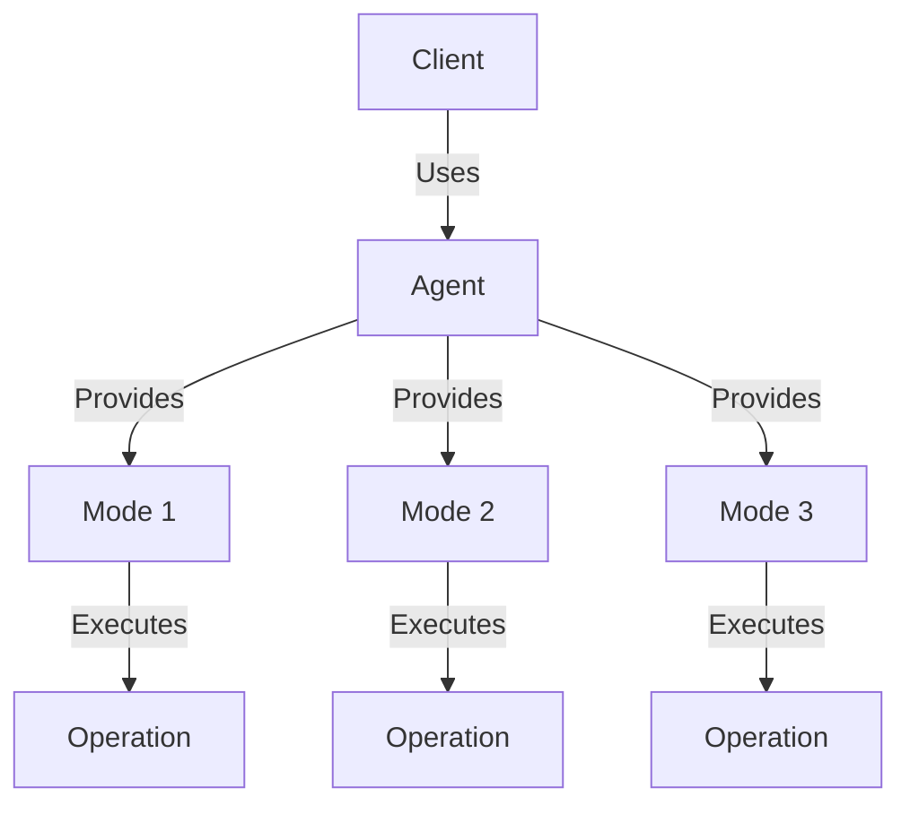
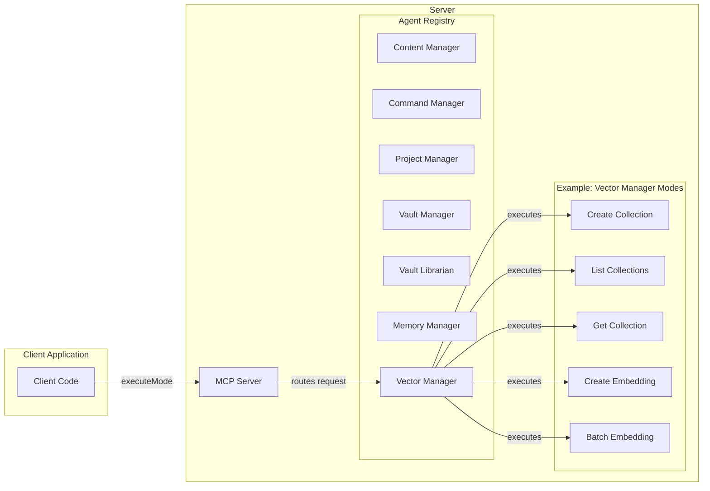

# Claudesidian MCP Plugin for Obsidian

Claudesidian MCP is an Obsidian plugin that enables AI assistants to interact with your vault through the Model Context Protocol (MCP). It provides atomic operations for vault management and implements a structured memory system. The plugin uses an Agent-Mode Architecture that organizes functionality into logical domains (agents) with specific operations (modes) within each domain.

## Features

- 🔌 MCP Server Integration
  - Seamlessly connects your vault to Claude Desktop via MCP
  - Exposes vault operations as MCP agents and modes
  - Implements secure access controls

- 📝 Vault Operations
  - Create and read notes
  - Search vault content
  - Manage file structure
  - Operate on frontmatter

- 🧠 Memory & Vector Architecture
  - Session and state management for workspaces
  - Vector collections for embeddings storage
  - Semantic search capabilities
  - Multiple embedding strategies (manual, live, idle, startup)
  - Batch operations for efficiency

- 🏗️ Agent-Mode Architecture
  - Domain-driven design with specialized agents
  - Consistent interfaces across all operations
  - Type-safe parameters and results
  - Built-in schema validation

## Installation

0. Make sure you have the latest version of [node.js installed](https://nodejs.org/en/download)
1. Install the plugin by downloading the latest release, specifically these files:
  - manifest.json
  - styles.css
  - main.js
  - connector.js
2. Save those files in `path/to/vault/.obsidian/plugins/claudesidian-mcp` (you will need to make the claudesidian-mcp folder)
3. Enable the plugin in Obsidian's settings
4. Configure your claude desktop config file (instructions in the plugin settings)
5. Restart obsidian (if it's open) and fully restart claude (you might have to go to your task manager and end the task, as it runs in the background if you just `x` out).

## Multi-Vault Support

Claudesidian MCP supports running across multiple Obsidian vaults simultaneously, with each vault having its own isolated MCP server instance.

### Setting Up Multiple Vaults

1. **Install the plugin in each vault** following the standard installation steps above.

2. **Configure each vault in your Claude Desktop configuration file** (`claude_desktop_config.json`):
   - Each vault needs its own unique entry in the `mcpServers` section
   - The server identifier follows the pattern: `claudesidian-mcp-[sanitized-vault-name]`
   - Each entry points to the connector.js file in that specific vault's plugin directory

   Example configuration for multiple vaults:

   ```json
   {
     "mcpServers": {
       "claudesidian-mcp-personal-vault": {
         "command": "node",
         "args": [
           "C:\\Users\\username\\Documents\\Personal Vault\\.obsidian\\plugins\\claudesidian-mcp\\connector.js"
         ]
       },
       "claudesidian-mcp-work-vault": {
         "command": "node",
         "args": [
           "C:\\Users\\username\\Documents\\Work Vault\\.obsidian\\plugins\\claudesidian-mcp\\connector.js"
         ]
       }
     }
   }
   ```

3. **Restart Claude Desktop** completely to apply the configuration changes.

4. **Enable the plugin in each vault's Obsidian settings**.

### Important Considerations

- Each vault runs its own server process, which uses system resources
- Each vault maintains isolated settings and configurations
- Tools can only access files within their respective vault
- The vault name is sanitized by converting to lowercase and replacing spaces/special characters with hyphens

### Troubleshooting Multi-Vault Setup

- Verify each vault has a unique server identifier in the configuration
- Check that the paths to connector.js are correct for each vault
- Ensure IPC paths don't conflict
- If experiencing issues, check the plugin logs for each vault

## Automatic Embedding Strategies

Claudesidian MCP offers multiple strategies for embedding your notes, giving you control over when and how your content is indexed for semantic search. These strategies can be configured in the plugin settings under the "Memory" tab.

### Available Embedding Strategies

#### 1. Manual Only
- **Description**: No automatic embedding; you control exactly when to index content
- **Best for**: Users who want complete control over the indexing process
- **How it works**: You need to manually trigger indexing through the "Reindex All Content" button in settings or via MCP tools

#### 2. Live Embedding
- **Description**: Embeds files immediately when they are created or modified
- **Best for**: Real-time search capabilities, smaller vaults
- **How it works**: File change events trigger immediate embedding of modified content
- **Considerations**: May consume more API tokens, can cause brief UI pauses during embedding

#### 3. Idle Embedding
- **Description**: Waits for a period of inactivity before processing changes
- **Best for**: Balancing real-time updates with performance
- **How it works**: 
  - Files are queued when modified
  - After a configurable idle period (default: 60 seconds), queued files are processed
  - Changes are batched for efficiency
- **Considerations**: Good balance between token usage and having up-to-date embeddings

#### 4. Startup Embedding
- **Description**: Indexes non-embedded files when Obsidian starts
- **Best for**: New vaults or infrequently updated content
- **How it works**: 
  - On plugin initialization, it compares existing files with already-embedded content
  - Only processes files that have no existing embedding
- **Considerations**: Might cause initial slowdown when Obsidian starts, but doesn't interfere during regular use

### Changing Embedding Strategy

1. Open Obsidian Settings
2. Navigate to the "Claudesidian MCP" plugin settings
3. Go to the "Memory" tab
4. In the "Embedding" section, find "Embedding Strategy" dropdown
5. Select your preferred strategy
6. If you select "Idle", you can also configure the idle time threshold

### Additional Settings

- **Idle Time Threshold**: For the Idle strategy, controls how long to wait (5-300 seconds) after the last change before processing
- **Batch Size**: Controls how many files are processed together in a batch
- **Processing Delay**: Controls the delay between processing batches (to reduce UI freezing)
- **Concurrent Requests**: Controls how many API requests can run in parallel

### Best Practices

1. For large vaults, use "Idle" or "Startup" strategy to avoid performance issues
2. For small vaults or if you need real-time search, "Live" strategy works well
3. If you're concerned about API token usage, use "Manual" or "Startup" strategy
4. Configure exclusion patterns to skip folders you don't want to index (like images, attachments, etc.)

## Security

- The plugin runs an MCP server that only accepts local connections
- All vault operations require explicit user permission
- Memory storage is contained within your vault
- No data is sent externally without consent, except for embedding API calls if you enable the Memory Manager feature

## Agent-Mode Architecture

The Agent-Mode architecture represents a significant evolution in the plugin's design, moving from individual tools to a more structured approach where agents provide multiple modes of operation. This architecture organizes functionality into logical domains (agents) with specific operations (modes) within each domain.



### Benefits of the Agent-Mode Architecture

- **Domain-Driven Design**: Functionality is organized by domain (agents), making the codebase more intuitive
- **Consistent Interfaces**: All agents and modes follow the same interface patterns
- **Improved Maintainability**: Common functionality is shared through base classes
- **Better Discoverability**: Modes are grouped by agent, making it easier to find related functionality
- **Type Safety**: Generic types for parameters and results provide better type checking
- **Schema Validation**: Built-in schema definitions for parameters and results

### Available Agents and Their Modes

The plugin features eight specialized agents, each handling a specific domain of functionality:

#### 1. NoteEditor Agent
The NoteEditor agent provides operations for editing notes in the vault.

| Mode     | Description                    | Parameters                                      |
|----------|--------------------------------|-------------------------------------------------|
| replace  | Replace text in a note         | path, search, replace, replaceAll               |
| insert   | Insert text at a position      | path, content, position                         |
| delete   | Delete lines from a note       | path, startPosition, endPosition                |
| append   | Append text to a note          | path, content                                   |
| prepend  | Prepend text to a note         | path, content                                   |
| batch    | Perform multiple operations    | operations[]                                    |

#### 2. NoteReader Agent
The NoteReader agent provides operations for reading notes from the vault.

| Mode      | Description                     | Parameters                                      |
|-----------|---------------------------------|-------------------------------------------------|
| readNote  | Read the content of a note      | path                                            |
| batchRead | Read multiple notes at once     | paths[]                                         |
| readLine  | Read specific lines from a note | path, startLine, endLine                        |

#### 3. ProjectManager Agent
The ProjectManager agent provides operations for managing projects.

| Mode         | Description                    | Parameters                                      |
|--------------|--------------------------------|-------------------------------------------------|
| projectPlan  | Generate a project plan        | primaryGoal, subgoals, path                     |
| askQuestion  | Ask a question about a project | context, questions                              |
| checkpoint   | Create a project checkpoint    | description, progressSummary, checkpointReason, nextStep, projectPath |

#### 4. PaletteCommander Agent
The PaletteCommander agent provides operations for executing commands from the command palette.

| Mode           | Description                       | Parameters                                      |
|----------------|-----------------------------------|-------------------------------------------------|
| listCommands   | List available commands           | filter (optional)                               |
| executeCommand | Execute a command by ID           | id                                              |

#### 5. VaultLibrarian Agent
The VaultLibrarian agent provides operations for searching and navigating the vault.

| Mode             | Description                       | Parameters                                      |
|------------------|-----------------------------------|-------------------------------------------------|
| searchContent    | Search note content               | query, paths, limit, includeMetadata            |
| searchTag        | Find notes with specific tag      | tag, paths, limit                               |
| searchProperty   | Find notes with specific property | key, value, paths, limit                        |
| listFolder       | List contents of a folder         | path, includeFiles, includeFolders              |
| listNote         | List notes in the vault           | path, extension, limit                          |
| listTag          | List all tags in the vault        | prefix, limit                                   |
| listProperties   | List all properties in the vault  | key, limit                                      |

#### 6. VaultManager Agent
The VaultManager agent provides operations for managing files and folders in the vault.

| Mode          | Description                       | Parameters                                      |
|---------------|-----------------------------------|-------------------------------------------------|
| createNote    | Create a new note                 | path, content, overwrite                        |
| createFolder  | Create a new folder               | path                                            |
| deleteNote    | Delete a note                     | path                                            |
| deleteFolder  | Delete a folder                   | path, recursive                                 |
| moveNote      | Move a note to a new location     | path, newPath, overwrite                        |
| moveFolder    | Move a folder to a new location   | path, newPath, overwrite                        |

#### 7. MemoryManager Agent
The MemoryManager agent provides session and state management for workspaces.

| Mode            | Description                              | Parameters                                      |
|-----------------|------------------------------------------|-------------------------------------------------|
| createSession   | Create a new session                     | name, description, sessionGoal                  |
| listSessions    | List available sessions                  | activeOnly, limit, order, tags                  |
| editSession     | Edit an existing session                 | sessionId, name, description, isActive          |
| deleteSession   | Delete a session                         | sessionId, deleteMemoryTraces                   |
| createState     | Create a new state snapshot              | name, description, includeSummary, maxFiles     |
| listStates      | List available state snapshots           | includeContext, limit, targetSessionId          |
| loadState       | Load a state snapshot                    | stateId, createContinuationSession              |
| editState       | Edit a state snapshot                    | stateId, name, description, addTags             |
| deleteState     | Delete a state snapshot                  | stateId                                         |

#### 8. VectorManager Agent
The VectorManager agent provides vector collections and embeddings management.

| Mode               | Description                              | Parameters                                      |
|--------------------|------------------------------------------|-------------------------------------------------|
| createCollection   | Create a new vector collection           | name, metadata                                  |
| listCollections    | List available vector collections        | pattern                                         |
| getCollection      | Get details about a collection           | name, includeStats                              |
| deleteCollection   | Delete a vector collection               | name, force                                     |
| collectionAddItems | Add items to a collection                | collectionName, ids, embeddings, metadatas      |
| createEmbedding    | Create embeddings from text              | collectionName, items                           |
| getEmbedding       | Get embeddings by ID                     | collectionName, ids, includeEmbeddings          |
| deleteEmbedding    | Delete embeddings from a collection      | collectionName, ids                             |
| batchEmbedding     | Perform batch operations on embeddings   | collectionName, operation, items                |



## Key Extensibility Features:

1. **Agent Interface & Base Class**
```typescript
// src/agents/interfaces/IAgent.ts
export interface IAgent {
    name: string;
    description: string;
    version: string;
    
    getModes(): IMode[];
    getMode(modeSlug: string): IMode | undefined;
    initialize(): Promise<void>;
    executeMode(modeSlug: string, params: any): Promise<any>;
}

// src/agents/base/BaseAgent.ts
export abstract class BaseAgent implements IAgent {
    // Common agent functionality
    protected modes = new Map<string, IMode>();
    
    registerMode(mode: IMode): void {
        // Mode registration logic
    }
}
```

2. **Mode Interface & Base Class**
```typescript
// src/agents/interfaces/IMode.ts
export interface IMode<T = any, R = any> {
    slug: string;
    name: string;
    description: string;
    version: string;
    
    execute(params: T): Promise<R>;
    getParameterSchema(): any;
    getResultSchema(): any;
}

// src/agents/base/BaseMode.ts
export abstract class BaseMode<T = any, R = any> implements IMode<T, R> {
    // Common mode functionality
}
```

3. **Example Agent Implementation**
```typescript
// src/agents/myAgent/myAgent.ts
import { BaseAgent } from '../base/BaseAgent';
import { OperationOneMode } from './modes/operationOneMode';
import { OperationTwoMode } from './modes/operationTwoMode';

export class MyAgent extends BaseAgent {
    constructor() {
        super(
            'myAgent',
            'My Agent',
            'Provides operations for my domain',
            '1.0.0'
        );
        
        // Register modes
        this.registerMode(new OperationOneMode());
        this.registerMode(new OperationTwoMode());
    }
    
    async initialize(): Promise<void> {
        // Initialize resources needed by modes
    }
}
```

4. **Example Mode Implementation**
```typescript
// src/agents/myAgent/modes/operationOneMode.ts
import { BaseMode } from '../../base/BaseMode';

export class OperationOneMode extends BaseMode<OperationOneParams, OperationOneResult> {
    constructor() {
        super(
            'operationOne',
            'Operation One',
            'Performs operation one',
            '1.0.0'
        );
    }
    
    async execute(params: OperationOneParams): Promise<OperationOneResult> {
        try {
            // Implement operation logic
            return {
                success: true,
                data: { /* result data */ }
            };
        } catch (error) {
            return {
                success: false,
                error: error.message
            };
        }
    }
    
    getParameterSchema(): any {
        return {
            type: 'object',
            properties: {
                param1: {
                    type: 'string',
                    description: 'First parameter'
                },
                param2: {
                    type: 'number',
                    description: 'Second parameter'
                }
            },
            required: ['param1', 'param2']
        };
    }
}
```

5. **Client Usage Example**
```typescript
// Execute a mode
const result = await server.executeMode('noteEditor', 'replace', {
    path: 'path/to/note.md',
    search: 'old text',
    replace: 'new text',
    replaceAll: true
});

// Check result
if (result.success) {
    console.log('Text replaced successfully');
} else {
    console.error('Error:', result.error);
}
```
