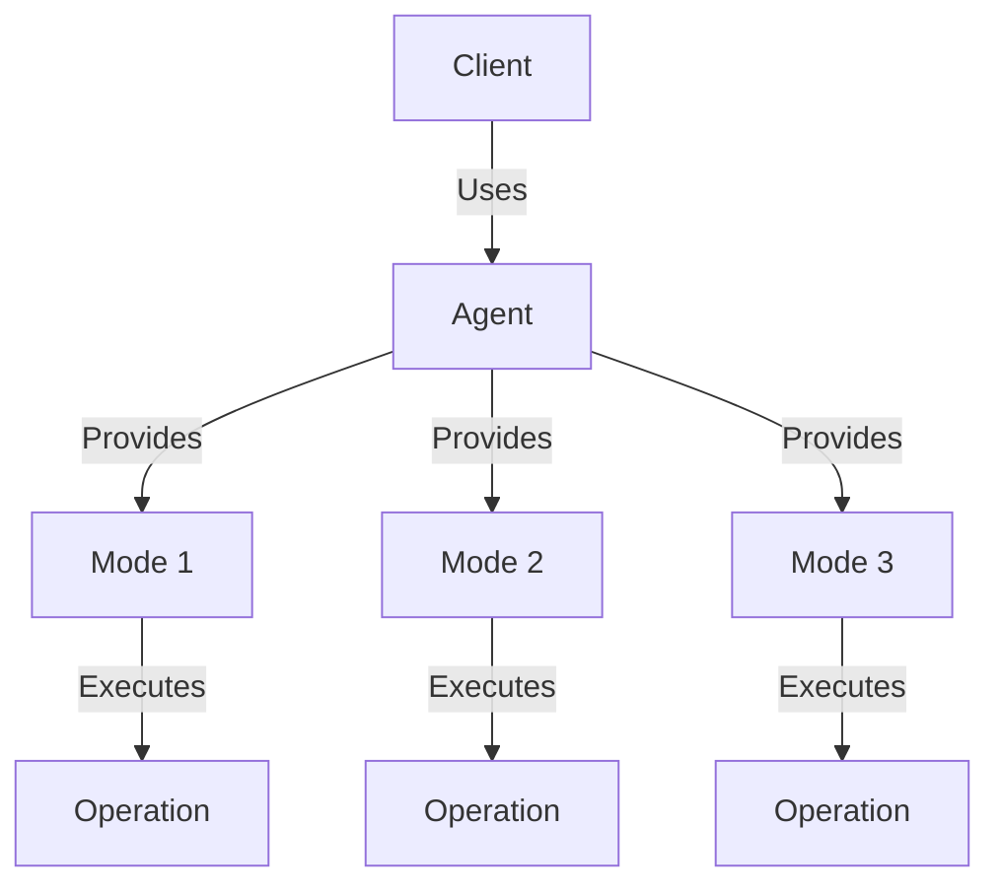
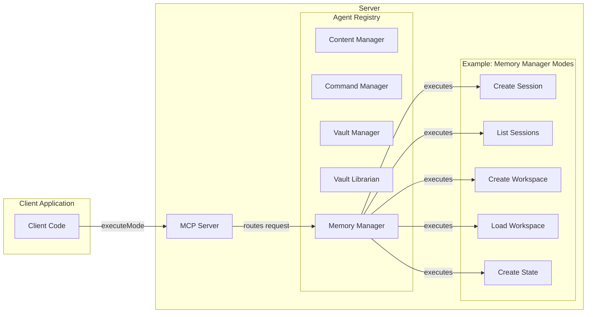

# Claudesidian MCP Plugin for Obsidian

Claudesidian MCP is an Obsidian plugin that enables AI assistants to interact with your vault through the Model Context Protocol (MCP). It provides atomic operations for vault management and implements a structured memory system. The plugin uses an Agent-Mode Architecture that organizes functionality into logical domains (agents) with specific operations (modes) within each domain.

> 🧪 Note that this is an experimental Obsidian Plugin. Always monitor API costs when using LLM features!

## Features

- 🔌 MCP Server Integration
  - Seamlessly connects your vault to Claude Desktop via MCP
  - Exposes vault operations as MCP agents and modes
  - Implements secure access controls

- 📝 Vault Operations
  - Create and read notes
  - Search vault content
  - Manage file structure
  - Operate on frontmatter

- 🧠 Memory Architecture
  - Session and state management for workspaces
  - JSON-based storage for vault organization
  - Efficient keyword-based search capabilities
  - Batch operations for efficiency

- 🔍 Advanced Search System
  - Text search with keyword and fuzzy matching
  - Intelligent query analysis for optimal results
  - Enhanced metadata search with tag and property filtering
  - Memory search across conversation history and workspaces

- 🔄 Automatic Data Migration
  - Seamlessly migrates from previous versions
  - Converts ChromaDB data to optimized JSON storage
  - No data loss during upgrade process
  - Maintains all workspace, session, and conversation history

- 🏗️ Agent-Mode Architecture
  - Domain-driven design with specialized agents
  - Consistent interfaces across all operations
  - Type-safe parameters and results
  - Built-in schema validation

## Installation

0. Make sure you have the latest version of [node.js installed](https://nodejs.org/en/download)
1. Install the plugin by downloading the latest release, specifically these files:
  - manifest.json
  - styles.css
  - main.js
  - connector.js
2. Save those files in `path/to/vault/.obsidian/plugins/claudesidian-mcp` (you will need to make the claudesidian-mcp folder)
3. Enable the plugin in Obsidian's settings
4. Configure your claude desktop config file (instructions in the plugin settings)
5. Restart obsidian (if it's open) and fully restart claude (you might have to go to your task manager and end the task, as it runs in the background if you just `x` out).

## Data Migration

If you're upgrading from a previous version that used ChromaDB storage, the plugin will automatically migrate your data:

- **Automatic Detection**: Plugin detects existing ChromaDB collections on startup
- **Seamless Migration**: Converts all workspace, session, and conversation data to JSON format
- **Data Preservation**: All your memory traces, conversation history, and workspace organization is maintained
- **New Storage**: Data is stored in `.obsidian/plugins/claudesidian-mcp/.data/` as optimized JSON files
- **Performance**: Faster startup and search with the new JSON-based architecture
- **Migration Status**: Check the console logs (Ctrl+Shift+I) for detailed migration progress

The migration happens automatically when you first load the updated plugin. Your original ChromaDB data is preserved for backup purposes.

## Multi-Vault Support

Claudesidian MCP supports running across multiple Obsidian vaults simultaneously, with each vault having its own isolated MCP server instance.

### Setting Up Multiple Vaults

1. **Install the plugin in each vault** following the standard installation steps above.

2. **Configure each vault in your Claude Desktop configuration file** (`claude_desktop_config.json`):
   - Each vault needs its own unique entry in the `mcpServers` section
   - The server identifier follows the pattern: `claudesidian-mcp-[sanitized-vault-name]`
   - Each entry points to the connector.js file in that specific vault's plugin directory

   Example configuration for multiple vaults:

   ```json
   {
     "mcpServers": {
       "claudesidian-mcp-personal-vault": {
         "command": "node",
         "args": [
           "C:\\Users\\username\\Documents\\Personal Vault\\.obsidian\\plugins\\claudesidian-mcp\\connector.js"
         ]
       },
       "claudesidian-mcp-work-vault": {
         "command": "node",
         "args": [
           "C:\\Users\\username\\Documents\\Work Vault\\.obsidian\\plugins\\claudesidian-mcp\\connector.js"
         ]
       }
     }
   }
   ```

3. **Restart Claude Desktop** completely to apply the configuration changes.

4. **Enable the plugin in each vault's Obsidian settings**.

### Important Considerations

- Each vault runs its own server process, which uses system resources
- Each vault maintains isolated settings and configurations
- Tools can only access files within their respective vault


## Advanced Search Capabilities

Claudesidian MCP includes a sophisticated search system that uses efficient keyword-based indexing to provide fast and relevant results for your queries.


### Enhanced Metadata Search

Advanced metadata search capabilities include:

- **Tag-based search**: Find files by specific tags or combinations of tags
- **Property filtering**: Search by custom properties and frontmatter fields
- **Pattern matching**: Use regular expressions for complex property searches
- **Combined criteria**: Combine tags and properties with AND/OR logic

### Memory Search

Search across your conversation history and workspace memory:

- **Memory traces**: Find past conversations and AI interactions
- **Session history**: Search within specific session contexts  
- **Workspace memory**: Locate project-specific information
- **Context preservation**: Maintain conversation continuity across searches

### Search Result Features

- **File-based grouping**: Results grouped by file with multiple snippets per file
- **Relevance scoring**: Advanced scoring considers content type, exact matches, and graph relationships
- **Connected notes**: Discover related notes through wikilink connections
- **Rich metadata**: Includes file paths, modification dates, and content previews

## Security

- The plugin runs an MCP server that only accepts local connections
- All vault operations require explicit user permission
- Memory storage is contained within your vault
- No data is sent externally without consent, except for LLM API calls when using AI features

## LLM Integration and Custom Agent Management

Claudesidian MCP includes a comprehensive **AgentManager** that transforms your vault into an AI-powered workspace. Create custom AI agents, execute prompts directly from your notes, and integrate with multiple LLM providers for sophisticated automation workflows.

### LLM Provider Support

The plugin supports multiple LLM providers with comprehensive model management:

- **Anthropic Claude**: Claude-3.5-Sonnet, Claude-3-Haiku, Claude-3-Opus models
- **OpenAI**: GPT-4o, GPT-4-Turbo, GPT-3.5-Turbo, and other models
- **Google Gemini**: Gemini-1.5-Pro, Gemini-1.5-Flash models
- **Groq**: Ultra-fast inference with Llama, Mixtral, and Gemma models
- **Ollama**: Local LLM execution with complete privacy
- **Perplexity**: Search-augmented AI responses
- **OpenRouter**: Access to hundreds of AI models through a unified API
- **Mistral**: High-performance European AI models
- **Requesty**: Cost-optimized AI model access

### Setting Up API Keys

To use LLM features, configure your API keys in the plugin settings:

1. **Open Settings**: Go to Obsidian Settings → Claudesidian MCP → LLM Providers
2. **Select Provider**: Choose your preferred LLM provider(s)
3. **Add API Key**: Enter your API key for each provider:
   - **Anthropic**: Get your key from [console.anthropic.com](https://console.anthropic.com)
   - **OpenAI**: Get your key from [platform.openai.com](https://platform.openai.com/api-keys)
   - **Google**: Get your key from [aistudio.google.com](https://aistudio.google.com/app/apikey)
   - **Groq**: Get your key from [console.groq.com](https://console.groq.com/keys)
   - **Perplexity**: Get your key from [perplexity.ai](https://www.perplexity.ai/settings/api)
   - **OpenRouter**: Get your key from [openrouter.ai/keys](https://openrouter.ai/keys)
   - **Mistral**: Get your key from [console.mistral.ai/api-keys](https://console.mistral.ai/api-keys)
   - **Requesty**: Get your key from [requesty.ai](https://requesty.ai) - Unified LLM platform
   - **Ollama**: No API key needed for local setup
4. **Set Default Model**: Choose your preferred default model and provider
5. **Test Configuration**: Use the `listModels` mode to verify your setup

### Custom Agent Features

- **Specialized AI Agents**: Create domain-specific prompts for recurring tasks
- **File Integration**: Include vault content as context in AI prompts
- **Automated Actions**: Execute ContentManager operations with AI responses
- **Model Selection**: Choose optimal models for different tasks
- **Cost Tracking**: Monitor API usage and costs across providers
- **Batch Processing**: Execute multiple prompts efficiently
- **Session Integration**: Context-aware conversations with memory persistence

### AI-Powered Workflow Examples

1. **Content Creation**:
   ```
   executePrompt:
     agent: "technical-writer"
     prompt: "Create documentation for this API"
     filepaths: ["api-spec.md"]
     action: { type: "create", targetPath: "docs/api-documentation.md" }
   ```

2. **Code Review**:
   ```
   executePrompt:
     agent: "code-reviewer"
     prompt: "Review this code for best practices"
     filepaths: ["src/main.ts"]
     action: { type: "append", targetPath: "review-notes.md" }
   ```

3. **Research Analysis**:
   ```
   executePrompt:
     agent: "research-assistant"
     prompt: "Summarize key findings and create action items"
     filepaths: ["research/*.md"]
     action: { type: "create", targetPath: "analysis/summary.md" }
   ```

### Managing Custom Agents

Through the AgentManager, you can:

1. **Create Specialized Agents**: Define custom prompts for specific domains
2. **Execute AI Workflows**: Run prompts with file context and automated actions
3. **Monitor Performance**: Track usage, costs, and model performance
4. **Batch Operations**: Process multiple files or prompts efficiently
5. **Model Management**: List available models with capabilities and pricing
6. **Integration**: Seamlessly connect with vault content and memory systems

### Advanced AI Features

- **Context Windows**: Leverage large context windows (up to 200K+ tokens)
- **Structured Output**: Generate JSON, YAML, or formatted responses
- **Image Analysis**: Process images with vision-capable models
- **Function Calling**: Execute structured operations based on AI decisions
- **Streaming Responses**: Real-time response generation for better UX
- **Cost Optimization**: Automatic model selection based on task requirements

## Agent-Mode Architecture

The Agent-Mode architecture represents a significant evolution in the plugin's design, moving from individual tools to a more structured approach where agents provide multiple modes of operation. This architecture organizes functionality into logical domains (agents) with specific operations (modes) within each domain.



### Benefits of the Agent-Mode Architecture

- **Domain-Driven Design**: Functionality is organized by domain (agents), making the codebase more intuitive
- **Consistent Interfaces**: All agents and modes follow the same interface patterns
- **Improved Maintainability**: Common functionality is shared through base classes
- **Better Discoverability**: Modes are grouped by agent, making it easier to find related functionality
- **Type Safety**: Generic types for parameters and results provide better type checking
- **Schema Validation**: Built-in schema definitions for parameters and results

### Available Agents and Their Modes

The plugin features six specialized agents, each handling a specific domain of functionality:

#### 1. ContentManager Agent
The ContentManager agent provides operations for reading and editing notes in the vault (combines functionality of the previous NoteEditor and NoteReader agents).

| Mode              | Description                         | Parameters                                     |
|-------------------|-------------------------------------|------------------------------------------------|
| readContent       | Read content from a note            | path                                           |
| createContent     | Create a new note with content      | path, content, overwrite                       |
| appendContent     | Append content to a note            | path, content                                  |
| prependContent    | Prepend content to a note           | path, content                                  |
| replaceContent    | Replace content in a note           | path, search, replace, replaceAll              |
| replaceByLine     | Replace content by line numbers     | path, startLine, endLine, content              |
| deleteContent     | Delete content from a note          | path, startPosition, endPosition               |
| findReplaceContent| Find and replace content with regex | path, findPattern, replacePattern, flags      |
| batchContent      | Perform multiple content operations | operations[]                                   |

#### 2. CommandManager Agent
The CommandManager agent provides operations for executing commands from the command palette.

| Mode           | Description                       | Parameters                                     |
|----------------|-----------------------------------|------------------------------------------------|
| listCommands   | List available commands           | filter (optional)                              |
| executeCommand | Execute a command by ID           | id                                             |

#### 3. VaultManager Agent
The VaultManager agent provides operations for managing files and folders in the vault.

| Mode         | Description                     | Parameters                                     |
|--------------|---------------------------------|------------------------------------------------|
| listFiles    | List files in a folder          | path, recursive, extension                     |
| listFolders  | List folders in a path          | path, recursive                                |
| createFolder | Create a new folder             | path                                           |
| editFolder   | Rename a folder                 | path, newName                                  |
| deleteFolder | Delete a folder                 | path, recursive                                |
| moveNote     | Move a note to a new location   | path, newPath, overwrite                       |
| moveFolder   | Move a folder to a new location | path, newPath, overwrite                       |
| duplicateNote| Create a duplicate of a note    | sourcePath, targetPath, overwrite             |

#### 4. VaultLibrarian Agent
The VaultLibrarian agent provides advanced search operations across the vault using efficient keyword-based methods.

| Mode            | Description                            | Parameters                                     |
|-----------------|----------------------------------------|------------------------------------------------|
| universalSearch | Universal search with keyword matching | query, type, paths, limit, includeMetadata    |
| searchFiles     | Search and discover files by name      | query, path, recursive, extension, limit      |
| searchFolders   | Search and discover folders by name    | query, path, recursive, limit                  |
| searchMemory    | Search workspace and conversation data | query, limit, workspaceFilter, type           |
| batch           | Perform batch search operations        | operations[]                                   |

#### 5. MemoryManager Agent
The MemoryManager agent provides operations for managing sessions, states, and workspaces.

| Mode            | Description                         | Parameters                                    |
|-----------------|-------------------------------------|-----------------------------------------------|
| createSession   | Create a new session                | name, description, sessionGoal                |
| listSessions    | List available sessions             | activeOnly, limit, order, tags                |
| editSession     | Edit an existing session            | sessionId, name, description, isActive        |
| deleteSession   | Delete a session                    | sessionId, deleteMemoryTraces                 |
| loadSession     | Load an existing session            | sessionId                                     |
| createState     | Create a new state snapshot         | name, description, includeSummary, maxFiles   |
| listStates      | List available state snapshots      | includeContext, limit, targetSessionId        |
| loadState       | Load a state snapshot               | stateId, createContinuationSession            |
| editState       | Edit a state snapshot               | stateId, name, description, addTags           |
| deleteState     | Delete a state snapshot             | stateId                                       |
| createWorkspace | Create a new workspace              | name, description, tags                       |
| listWorkspaces  | List available workspaces           | limit, order, tags                            |
| editWorkspace   | Edit a workspace                    | workspaceId, name, description, addTags       |
| deleteWorkspace | Delete a workspace                  | workspaceId, deleteAll                        |
| loadWorkspace   | Load a workspace                    | workspaceId                                   |
| searchMemory    | Search memory traces and sessions   | query, type, limit, workspaceFilter           |

#### 6. AgentManager Agent
The AgentManager agent provides comprehensive operations for managing custom AI prompts, LLM model management, and executing AI-powered workflows directly from your vault.

| Mode                | Description                                    | Parameters                                                        |
|---------------------|------------------------------------------------|-------------------------------------------------------------------|
| listPrompts         | List all or enabled custom prompts            | enabledOnly, sessionId, context                                   |
| getPrompt           | Get a specific custom prompt                   | id, name, sessionId, context                                      |
| createPrompt        | Create a new custom prompt                     | name, prompt, enabled, sessionId, context                         |
| updatePrompt        | Update an existing custom prompt               | id, name, prompt, enabled, sessionId, context                     |
| deletePrompt        | Delete a custom prompt                         | id, sessionId, context                                            |
| togglePrompt        | Toggle prompt enabled/disabled state           | id, sessionId, context                                            |
| listModels          | List available LLM models and capabilities     | sessionId, context                                                |
| executePrompt       | Execute prompts with LLM integration           | agent, filepaths, prompt, provider, model, temperature, maxTokens, action, sessionId, context |
| batchExecutePrompt  | Execute multiple prompts in sequence           | prompts[], sessionId, context                                     |




## Key Extensibility Features:

1. **Agent Interface & Base Class**
```typescript
// src/agents/interfaces/IAgent.ts
export interface IAgent {
    name: string;
    description: string;
    version: string;
    
    getModes(): IMode[];
    getMode(modeSlug: string): IMode | undefined;
    initialize(): Promise<void>;
    executeMode(modeSlug: string, params: any): Promise<any>;
}

// src/agents/base/BaseAgent.ts
export abstract class BaseAgent implements IAgent {
    // Common agent functionality
    protected modes = new Map<string, IMode>();
    
    registerMode(mode: IMode): void {
        // Mode registration logic
    }
}
```

2. **Mode Interface & Base Class**
```typescript
// src/agents/interfaces/IMode.ts
export interface IMode<T = any, R = any> {
    slug: string;
    name: string;
    description: string;
    version: string;
    
    execute(params: T): Promise<R>;
    getParameterSchema(): any;
    getResultSchema(): any;
}

// src/agents/base/BaseMode.ts
export abstract class BaseMode<T = any, R = any> implements IMode<T, R> {
    // Common mode functionality
}
```

3. **Example Agent Implementation**
```typescript
// src/agents/myAgent/myAgent.ts
import { BaseAgent } from '../base/BaseAgent';
import { OperationOneMode } from './modes/operationOneMode';
import { OperationTwoMode } from './modes/operationTwoMode';

export class MyAgent extends BaseAgent {
    constructor() {
        super(
            'myAgent',
            'My Agent',
            'Provides operations for my domain',
            '1.0.0'
        );
        
        // Register modes
        this.registerMode(new OperationOneMode());
        this.registerMode(new OperationTwoMode());
    }
    
    async initialize(): Promise<void> {
        // Initialize resources needed by modes
    }
}
```

4. **Example Mode Implementation**
```typescript
// src/agents/myAgent/modes/operationOneMode.ts
import { BaseMode } from '../../base/BaseMode';

export class OperationOneMode extends BaseMode<OperationOneParams, OperationOneResult> {
    constructor() {
        super(
            'operationOne',
            'Operation One',
            'Performs operation one',
            '1.0.0'
        );
    }
    
    async execute(params: OperationOneParams): Promise<OperationOneResult> {
        try {
            // Implement operation logic
            return {
                success: true,
                data: { /* result data */ }
            };
        } catch (error) {
            return {
                success: false,
                error: error.message
            };
        }
    }
    
    getParameterSchema(): any {
        return {
            type: 'object',
            properties: {
                param1: {
                    type: 'string',
                    description: 'First parameter'
                },
                param2: {
                    type: 'number',
                    description: 'Second parameter'
                }
            },
            required: ['param1', 'param2']
        };
    }
}
```

5. **Client Usage Example**
```typescript
// Execute a mode
const result = await server.executeMode('noteEditor', 'replace', {
    path: 'path/to/note.md',
    search: 'old text',
    replace: 'new text',
    replaceAll: true
});

// Check result
if (result.success) {
    console.log('Text replaced successfully');
} else {
    console.error('Error:', result.error);
}
```
