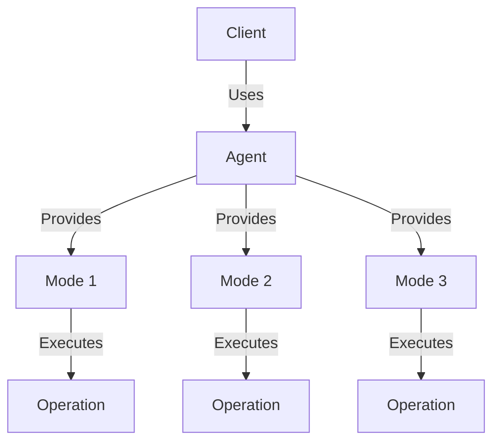
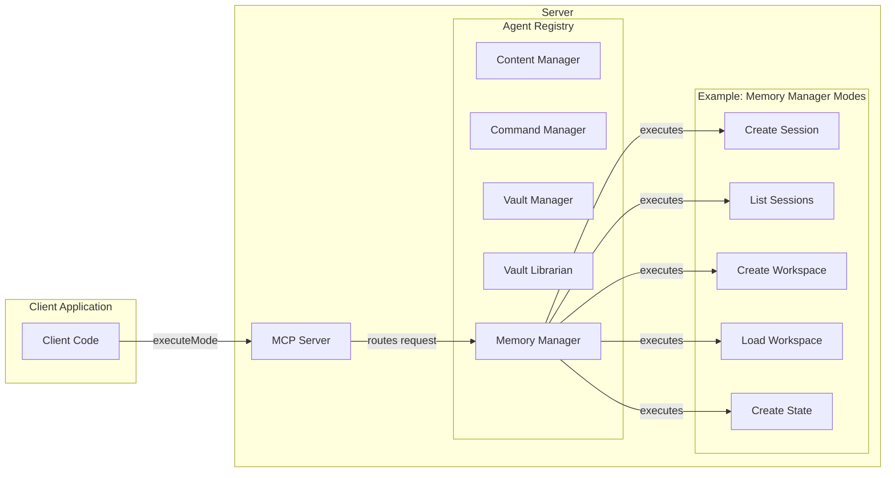

# Claudesidian MCP Plugin for Obsidian

Claudesidian MCP is an Obsidian plugin that enables AI assistants to interact with your vault through the Model Context Protocol (MCP). It provides atomic operations for vault management and implements a structured memory system. The plugin uses an Agent-Mode Architecture that organizes functionality into logical domains (agents) with specific operations (modes) within each domain.

> 🧪 Note that this is an experimental Obsidian Plugin. The _Memory_ Functionality in particular is relatively untested, so be sure you know enough about embeddings and vector databases to understand what you are doing, and always watch those API costs!

## Features

- 🔌 MCP Server Integration
  - Seamlessly connects your vault to Claude Desktop via MCP
  - Exposes vault operations as MCP agents and modes
  - Implements secure access controls

- 📝 Vault Operations
  - Create and read notes
  - Search vault content
  - Manage file structure
  - Operate on frontmatter

- 🧠 Memory & Vector Architecture
  - Session and state management for workspaces
  - Vector collections for embeddings storage
  - Semantic search capabilities
  - Multiple embedding strategies (manual, live, idle, startup)
  - Batch operations for efficiency

- 🔍 Advanced Search System
  - Hybrid search combining semantic, keyword, and fuzzy matching
  - Reciprocal Rank Fusion (RRF) for intelligent result ranking
  - Multi-method search with automatic query analysis
  - Enhanced metadata search with tag and property filtering
  - Memory search across conversation history and workspaces

- 🏗️ Agent-Mode Architecture
  - Domain-driven design with specialized agents
  - Consistent interfaces across all operations
  - Type-safe parameters and results
  - Built-in schema validation

## Installation

0. Make sure you have the latest version of [node.js installed](https://nodejs.org/en/download)
1. Install the plugin by downloading the latest release, specifically these files:
  - manifest.json
  - styles.css
  - main.js
  - connector.js
2. Save those files in `path/to/vault/.obsidian/plugins/claudesidian-mcp` (you will need to make the claudesidian-mcp folder)
3. Enable the plugin in Obsidian's settings
4. Configure your claude desktop config file (instructions in the plugin settings)
5. Restart obsidian (if it's open) and fully restart claude (you might have to go to your task manager and end the task, as it runs in the background if you just `x` out).

## Multi-Vault Support

Claudesidian MCP supports running across multiple Obsidian vaults simultaneously, with each vault having its own isolated MCP server instance.

### Setting Up Multiple Vaults

1. **Install the plugin in each vault** following the standard installation steps above.

2. **Configure each vault in your Claude Desktop configuration file** (`claude_desktop_config.json`):
   - Each vault needs its own unique entry in the `mcpServers` section
   - The server identifier follows the pattern: `claudesidian-mcp-[sanitized-vault-name]`
   - Each entry points to the connector.js file in that specific vault's plugin directory

   Example configuration for multiple vaults:

   ```json
   {
     "mcpServers": {
       "claudesidian-mcp-personal-vault": {
         "command": "node",
         "args": [
           "C:\\Users\\username\\Documents\\Personal Vault\\.obsidian\\plugins\\claudesidian-mcp\\connector.js"
         ]
       },
       "claudesidian-mcp-work-vault": {
         "command": "node",
         "args": [
           "C:\\Users\\username\\Documents\\Work Vault\\.obsidian\\plugins\\claudesidian-mcp\\connector.js"
         ]
       }
     }
   }
   ```

3. **Restart Claude Desktop** completely to apply the configuration changes.

4. **Enable the plugin in each vault's Obsidian settings**.

### Important Considerations

- Each vault runs its own server process, which uses system resources
- Each vault maintains isolated settings and configurations
- Tools can only access files within their respective vault
- The vault name is sanitized by converting to lowercase and replacing spaces/special characters with hyphens

### Troubleshooting Multi-Vault Setup

- Verify each vault has a unique server identifier in the configuration
- Check that the paths to connector.js are correct for each vault
- Ensure IPC paths don't conflict
- If experiencing issues, check the plugin logs for each vault

## Automatic Embedding Strategies

Claudesidian MCP offers multiple strategies for embedding your notes, giving you control over when and how your content is indexed for semantic search. These strategies can be configured in the plugin settings under the "Memory" tab.

### Available Embedding Strategies

#### 1. Manual Only
- **Description**: No automatic embedding; you control exactly when to index content
- **Best for**: Users who want complete control over the indexing process
- **How it works**: You need to manually trigger indexing through the "Reindex All Content" button in settings or via MCP tools

#### 2. Live Embedding
- **Description**: Embeds files immediately when they are created or modified
- **Best for**: Real-time search capabilities, smaller vaults
- **How it works**: File change events trigger immediate embedding of modified content
- **Considerations**: May consume more API tokens, can cause brief UI pauses during embedding

#### 3. Idle Embedding
- **Description**: Waits for a period of inactivity before processing changes
- **Best for**: Balancing real-time updates with performance
- **How it works**: 
  - Files are queued when modified
  - After a configurable idle period (default: 60 seconds), queued files are processed
  - Changes are batched for efficiency
- **Considerations**: Good balance between token usage and having up-to-date embeddings

#### 4. Startup Embedding
- **Description**: Indexes non-embedded files when Obsidian starts
- **Best for**: New vaults or infrequently updated content
- **How it works**: 
  - On plugin initialization, it compares existing files with already-embedded content
  - Only processes files that have no existing embedding
- **Considerations**: Might cause initial slowdown when Obsidian starts, but doesn't interfere during regular use

### Changing Embedding Strategy

1. Open Obsidian Settings
2. Navigate to the "Claudesidian MCP" plugin settings
3. Go to the "Memory" tab
4. In the "Embedding" section, find "Embedding Strategy" dropdown
5. Select your preferred strategy
6. If you select "Idle", you can also configure the idle time threshold

### Additional Settings

- **Idle Time Threshold**: For the Idle strategy, controls how long to wait (5-300 seconds) after the last change before processing
- **Batch Size**: Controls how many files are processed together in a batch
- **Processing Delay**: Controls the delay between processing batches (to reduce UI freezing)
- **Concurrent Requests**: Controls how many API requests can run in parallel

### Best Practices

1. For large vaults, use "Idle" or "Startup" strategy to avoid performance issues
2. For small vaults or if you need real-time search, "Live" strategy works well
3. If you're concerned about API token usage, use "Manual" or "Startup" strategy
4. Configure exclusion patterns to skip folders you don't want to index (like images, attachments, etc.)

## Setting Up Ollama for Local Embeddings

Ollama provides a way to run embedding models locally, offering complete privacy and eliminating API costs. Claudesidian MCP has built-in support for Ollama embedding models.

### Installing Ollama on Windows

1. **Download Ollama**:
   - Visit https://ollama.com/download/windows
   - Download the `OllamaSetup.exe` installer
   - Run the installer and follow the setup wizard (no admin rights required)

2. **Start Ollama Service**:
   - Open Command Prompt or PowerShell
   - Run: `ollama serve`
   - Keep this terminal window open (Ollama runs in the background)

3. **Download an Embedding Model**:
   - Open a new terminal window
   - Run: `ollama pull nomic-embed-text`
   - Wait for the model to download (this may take a few minutes)

4. **Verify Installation**:
   - Test with: `ollama list`
   - You should see `nomic-embed-text` in the list

### Configuring Claudesidian for Ollama

1. **Open Obsidian Settings**:
   - Go to Settings → Claudesidian MCP → Memory tab

2. **Select Ollama Provider**:
   - Set "API Provider" to "Ollama (Local)"
   - Set "Embedding Model" to "nomic-embed-text"
   - Dimensions will automatically set to 768

3. **Restart Obsidian** to apply the changes

### Supported Ollama Models

Claudesidian supports several Ollama embedding models:

| Model | Dimensions | Description |
|-------|------------|-------------|
| `nomic-embed-text` | 768 | High-quality general-purpose embeddings |
| `nomic-embed-text:latest` | 768 | Latest version of Nomic Embed Text |
| `mxbai-embed-large` | 1024 | MixedBread AI's large embedding model |
| `all-minilm` | 384 | Lightweight, fast embeddings |
| `snowflake-arctic-embed` | 768 | Snowflake's Arctic embedding model |

### Benefits of Local Ollama Embeddings

- **Privacy**: All data stays on your machine
- **Cost**: No API fees or token limits
- **Speed**: Fast local processing
- **Offline**: Works without internet connection
- **Control**: Full control over model versions and updates

### Troubleshooting Ollama Setup

- **"Ollama not found"**: Ensure Ollama is installed and added to your system PATH
- **Connection issues**: Make sure `ollama serve` is running and accessible at `http://127.0.0.1:11434`
- **Model not found**: Verify the model was downloaded with `ollama list`
- **Performance issues**: Ensure you have sufficient RAM for the embedding model

### System Requirements

- **Windows**: Windows 10/11 (64-bit)
- **RAM**: At least 4GB free for embedding models
- **Storage**: Additional space for models (nomic-embed-text is ~274MB)
- **CPU**: Modern multi-core processor recommended

## Advanced Search Capabilities

Claudesidian MCP includes a sophisticated search system that combines multiple search methods to provide the most relevant results for your queries.

### Hybrid Search System

The plugin implements a **Hybrid Search** approach that combines three complementary search methods:

1. **Semantic Search**: Uses vector embeddings to find conceptually related content
2. **Keyword Search**: Employs BM25 algorithm for exact term matching
3. **Fuzzy Search**: Handles typos and variations in search terms

Results from all three methods are combined using **Reciprocal Rank Fusion (RRF)**, which intelligently weighs and merges results to provide the most relevant matches.

### Intelligent Query Analysis

The system automatically analyzes your search queries to determine the best search strategy:

- **Exact Queries**: Prioritizes keyword matching for precise terms
- **Conceptual Queries**: Emphasizes semantic understanding for abstract concepts  
- **Exploratory Queries**: Focuses on broad discovery and related topics
- **Mixed Queries**: Balances all search methods for comprehensive results

### Enhanced Metadata Search

Advanced metadata search capabilities include:

- **Tag-based search**: Find files by specific tags or combinations of tags
- **Property filtering**: Search by custom properties and frontmatter fields
- **Pattern matching**: Use regular expressions for complex property searches
- **Combined criteria**: Combine tags and properties with AND/OR logic

### Memory Search

Search across your conversation history and workspace memory:

- **Memory traces**: Find past conversations and AI interactions
- **Session history**: Search within specific session contexts  
- **Workspace memory**: Locate project-specific information
- **Context preservation**: Maintain conversation continuity across searches

### Search Result Features

- **File-based grouping**: Results grouped by file with multiple snippets per file
- **Relevance scoring**: Advanced scoring considers content type, exact matches, and graph relationships
- **Connected notes**: Discover related notes through wikilink connections
- **Rich metadata**: Includes file paths, modification dates, and content previews

## Security

- The plugin runs an MCP server that only accepts local connections
- All vault operations require explicit user permission
- Memory storage is contained within your vault
- No data is sent externally without consent, except for embedding API calls if you enable the Memory Manager feature

## Custom Prompts and Agent Management

Claudesidian MCP includes a powerful **AgentManager** that allows you to create and manage custom AI prompts, effectively creating your own specialized AI agents for specific tasks.

### Custom Prompt Features

- **Create Custom Agents**: Define specialized prompts for specific use cases
- **Enable/Disable Management**: Toggle prompts on/off as needed
- **Multi-Vault Support**: Separate prompt collections per vault
- **Persistent Storage**: Prompts are saved in your Obsidian settings
- **Session Integration**: Custom prompts work seamlessly with memory sessions

### Use Cases for Custom Prompts

- **Writing Assistants**: Create prompts for specific writing styles or formats
- **Code Review**: Specialized prompts for different programming languages
- **Research Helpers**: Domain-specific research and analysis prompts
- **Content Organization**: Prompts for structuring and organizing notes
- **Task-Specific Workflows**: Custom prompts for recurring tasks

### Managing Custom Prompts

Through the AgentManager, you can:

1. **List Prompts**: View all available custom prompts or only enabled ones
2. **Create Prompts**: Add new custom prompts with names and descriptions
3. **Update Prompts**: Modify existing prompts and their settings
4. **Toggle Status**: Enable or disable prompts without deleting them
5. **Delete Prompts**: Remove prompts you no longer need
6. **Get Specific Prompts**: Retrieve individual prompts by name or ID

Custom prompts integrate seamlessly with the plugin's session and memory management, allowing for sophisticated, context-aware AI interactions tailored to your specific needs.

## Agent-Mode Architecture

The Agent-Mode architecture represents a significant evolution in the plugin's design, moving from individual tools to a more structured approach where agents provide multiple modes of operation. This architecture organizes functionality into logical domains (agents) with specific operations (modes) within each domain.



### Benefits of the Agent-Mode Architecture

- **Domain-Driven Design**: Functionality is organized by domain (agents), making the codebase more intuitive
- **Consistent Interfaces**: All agents and modes follow the same interface patterns
- **Improved Maintainability**: Common functionality is shared through base classes
- **Better Discoverability**: Modes are grouped by agent, making it easier to find related functionality
- **Type Safety**: Generic types for parameters and results provide better type checking
- **Schema Validation**: Built-in schema definitions for parameters and results

### Available Agents and Their Modes

The plugin features six specialized agents, each handling a specific domain of functionality:

#### 1. ContentManager Agent
The ContentManager agent provides operations for reading and editing notes in the vault (combines functionality of the previous NoteEditor and NoteReader agents).

| Mode              | Description                         | Parameters                                     |
|-------------------|-------------------------------------|------------------------------------------------|
| readContent       | Read content from a note            | path                                           |
| createContent     | Create a new note with content      | path, content, overwrite                       |
| appendContent     | Append content to a note            | path, content                                  |
| prependContent    | Prepend content to a note           | path, content                                  |
| replaceContent    | Replace content in a note           | path, search, replace, replaceAll              |
| replaceByLine     | Replace content by line numbers     | path, startLine, endLine, content              |
| deleteContent     | Delete content from a note          | path, startPosition, endPosition               |
| findReplaceContent| Find and replace content with regex | path, findPattern, replacePattern, flags      |
| batchContent      | Perform multiple content operations | operations[]                                   |

#### 2. CommandManager Agent
The CommandManager agent provides operations for executing commands from the command palette.

| Mode           | Description                       | Parameters                                     |
|----------------|-----------------------------------|------------------------------------------------|
| listCommands   | List available commands           | filter (optional)                              |
| executeCommand | Execute a command by ID           | id                                             |

#### 3. VaultManager Agent
The VaultManager agent provides operations for managing files and folders in the vault.

| Mode         | Description                     | Parameters                                     |
|--------------|---------------------------------|------------------------------------------------|
| listFiles    | List files in a folder          | path, recursive, extension                     |
| listFolders  | List folders in a path          | path, recursive                                |
| createFolder | Create a new folder             | path                                           |
| editFolder   | Rename a folder                 | path, newName                                  |
| deleteFolder | Delete a folder                 | path, recursive                                |
| moveNote     | Move a note to a new location   | path, newPath, overwrite                       |
| moveFolder   | Move a folder to a new location | path, newPath, overwrite                       |
| duplicateNote| Create a duplicate of a note    | sourcePath, targetPath, overwrite             |

#### 4. VaultLibrarian Agent
The VaultLibrarian agent provides advanced search operations across the vault using multiple search methods.

| Mode          | Description                            | Parameters                                     |
|---------------|----------------------------------------|------------------------------------------------|
| search        | Universal search with hybrid methods   | query, type, paths, limit, includeMetadata    |
| searchFiles   | Search and discover files by name      | query, path, recursive, extension, limit      |
| searchFolders | Search and discover folders by name    | query, path, recursive, limit                  |
| vector        | Perform semantic vector search         | query, limit, filter, includeContent          |
| batch         | Perform batch search operations        | operations[]                                   |

#### 5. MemoryManager Agent
The MemoryManager agent provides operations for managing sessions, states, and workspaces.

| Mode            | Description                         | Parameters                                    |
|-----------------|-------------------------------------|-----------------------------------------------|
| createSession   | Create a new session                | name, description, sessionGoal                |
| listSessions    | List available sessions             | activeOnly, limit, order, tags                |
| editSession     | Edit an existing session            | sessionId, name, description, isActive        |
| deleteSession   | Delete a session                    | sessionId, deleteMemoryTraces                 |
| loadSession     | Load an existing session            | sessionId                                     |
| createState     | Create a new state snapshot         | name, description, includeSummary, maxFiles   |
| listStates      | List available state snapshots      | includeContext, limit, targetSessionId        |
| loadState       | Load a state snapshot               | stateId, createContinuationSession            |
| editState       | Edit a state snapshot               | stateId, name, description, addTags           |
| deleteState     | Delete a state snapshot             | stateId                                       |
| createWorkspace | Create a new workspace              | name, description, tags                       |
| listWorkspaces  | List available workspaces           | limit, order, tags                            |
| editWorkspace   | Edit a workspace                    | workspaceId, name, description, addTags       |
| deleteWorkspace | Delete a workspace                  | workspaceId, deleteAll                        |
| loadWorkspace   | Load a workspace                    | workspaceId                                   |
| searchMemory    | Search memory traces and sessions   | query, type, limit, workspaceFilter           |

#### 6. AgentManager Agent
The AgentManager agent provides operations for managing custom AI prompts and user-defined agents.

| Mode         | Description                         | Parameters                                    |
|--------------|-------------------------------------|-----------------------------------------------|
| listPrompts  | List all or enabled custom prompts | enabledOnly, sessionId, context               |
| getPrompt    | Get a specific custom prompt        | id, name, sessionId, context                  |
| createPrompt | Create a new custom prompt          | name, prompt, enabled, sessionId, context     |
| updatePrompt | Update an existing custom prompt    | id, name, prompt, enabled, sessionId, context |
| deletePrompt | Delete a custom prompt              | id, sessionId, context                        |
| togglePrompt | Toggle prompt enabled/disabled state| id, sessionId, context                        |




## Key Extensibility Features:

1. **Agent Interface & Base Class**
```typescript
// src/agents/interfaces/IAgent.ts
export interface IAgent {
    name: string;
    description: string;
    version: string;
    
    getModes(): IMode[];
    getMode(modeSlug: string): IMode | undefined;
    initialize(): Promise<void>;
    executeMode(modeSlug: string, params: any): Promise<any>;
}

// src/agents/base/BaseAgent.ts
export abstract class BaseAgent implements IAgent {
    // Common agent functionality
    protected modes = new Map<string, IMode>();
    
    registerMode(mode: IMode): void {
        // Mode registration logic
    }
}
```

2. **Mode Interface & Base Class**
```typescript
// src/agents/interfaces/IMode.ts
export interface IMode<T = any, R = any> {
    slug: string;
    name: string;
    description: string;
    version: string;
    
    execute(params: T): Promise<R>;
    getParameterSchema(): any;
    getResultSchema(): any;
}

// src/agents/base/BaseMode.ts
export abstract class BaseMode<T = any, R = any> implements IMode<T, R> {
    // Common mode functionality
}
```

3. **Example Agent Implementation**
```typescript
// src/agents/myAgent/myAgent.ts
import { BaseAgent } from '../base/BaseAgent';
import { OperationOneMode } from './modes/operationOneMode';
import { OperationTwoMode } from './modes/operationTwoMode';

export class MyAgent extends BaseAgent {
    constructor() {
        super(
            'myAgent',
            'My Agent',
            'Provides operations for my domain',
            '1.0.0'
        );
        
        // Register modes
        this.registerMode(new OperationOneMode());
        this.registerMode(new OperationTwoMode());
    }
    
    async initialize(): Promise<void> {
        // Initialize resources needed by modes
    }
}
```

4. **Example Mode Implementation**
```typescript
// src/agents/myAgent/modes/operationOneMode.ts
import { BaseMode } from '../../base/BaseMode';

export class OperationOneMode extends BaseMode<OperationOneParams, OperationOneResult> {
    constructor() {
        super(
            'operationOne',
            'Operation One',
            'Performs operation one',
            '1.0.0'
        );
    }
    
    async execute(params: OperationOneParams): Promise<OperationOneResult> {
        try {
            // Implement operation logic
            return {
                success: true,
                data: { /* result data */ }
            };
        } catch (error) {
            return {
                success: false,
                error: error.message
            };
        }
    }
    
    getParameterSchema(): any {
        return {
            type: 'object',
            properties: {
                param1: {
                    type: 'string',
                    description: 'First parameter'
                },
                param2: {
                    type: 'number',
                    description: 'Second parameter'
                }
            },
            required: ['param1', 'param2']
        };
    }
}
```

5. **Client Usage Example**
```typescript
// Execute a mode
const result = await server.executeMode('noteEditor', 'replace', {
    path: 'path/to/note.md',
    search: 'old text',
    replace: 'new text',
    replaceAll: true
});

// Check result
if (result.success) {
    console.log('Text replaced successfully');
} else {
    console.error('Error:', result.error);
}
```
