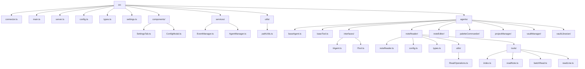

# Claudesidian MCP Plugin Reorganization Plan

This document outlines the comprehensive plan for reorganizing the Claudesidian MCP Plugin into an agent-based architecture. The plan is divided into four phases, each with detailed steps and code examples.

## Overview

The reorganization will transform the plugin from its current structure to an agent-based architecture where:

1. Each agent is responsible for a specific domain (noteReader, noteEditor, etc.)
2. Each agent has its own set of domain-specific tools
3. Common functionality is extracted into agent-specific utility classes
4. The codebase is more modular, maintainable, and extensible

## Directory Structure

```
src/
├── connector.ts                 # Main connector for the plugin
├── main.ts                      # Main entry point for the plugin
├── server.ts                    # MCP server implementation
├── config.ts                    # Configuration for the plugin
├── types.ts                     # Common types for the plugin (without AI-related types)
├── settings.ts                  # Settings management (without AI-related settings)
│
├── components/                  # UI components
│   ├── SettingsTab.ts           # Settings tab for the plugin
│   └── ConfigModal.ts           # Configuration modal (renamed from ClaudeConfigModal)
│
├── services/                    # Essential services (minimal set)
│   ├── EventManager.ts          # Event management service
│   └── AgentManager.ts          # Agent management service
│
├── utils/                       # Truly shared utilities
│   └── pathUtils.ts             # Path handling utilities
│
└── agents/                      # Agent definitions and implementations
    ├── baseAgent.ts             # Base agent class with common functionality
    ├── baseTool.ts              # Base tool class with common functionality
    │
    ├── interfaces/              # Minimal interfaces for agents and tools
    │   ├── IAgent.ts            # Interface for agents
    │   └── ITool.ts             # Interface for tools with proper typing for modes
    │
    ├── noteReader/              # Note Reader agent
    │   ├── noteReader.ts        # Orchestrator for the Note Reader agent
    │   ├── config.ts            # Configuration for the Note Reader agent
    │   ├── types.ts             # Types specific to the Note Reader agent
    │   ├── utils/               # Utilities specific to the Note Reader agent
    │   │   └── ReadOperations.ts # Read operations utility
    │   └── tools/               # Tools for the Note Reader agent
    │       ├── index.ts         # Exports all Note Reader tools
    │       ├── readNote.ts      # Tool for reading notes (read mode)
    │       ├── batchRead.ts     # Tool for batch reading notes (batchRead mode)
    │       └── readLine.ts      # Tool for reading specific lines (lineRead mode)
    │
    ├── noteEditor/              # Note Editor agent
    │   ├── noteEditor.ts        # Orchestrator for the Note Editor agent
    │   ├── config.ts            # Configuration for the Note Editor agent
    │   ├── types.ts             # Types specific to the Note Editor agent
    │   ├── utils/               # Utilities specific to the Note Editor agent
    │   │   └── EditOperations.ts # Edit operations utility
    │   └── tools/               # Tools for the Note Editor agent
    │       ├── index.ts         # Exports all Note Editor tools
    │       ├── singleEdit.ts    # Tool for single edits
    │       └── batchEdit.ts     # Tool for batch edits
    │
    ├── paletteCommander/        # Palette Commander agent
    │   ├── paletteCommander.ts  # Orchestrator for the Palette Commander agent
    │   ├── config.ts            # Configuration for the Palette Commander agent
    │   ├── types.ts             # Types specific to the Palette Commander agent
    │   └── tools/               # Tools for the Palette Commander agent
    │       ├── index.ts         # Exports all Palette Commander tools
    │       ├── listCommands.ts  # Tool for listing commands
    │       └── executeCommand.ts # Tool for executing commands
    │
    ├── projectManager/          # Project Manager agent
    │   ├── projectManager.ts    # Orchestrator for the Project Manager agent
    │   ├── config.ts            # Configuration for the Project Manager agent
    │   ├── types.ts             # Types specific to the Project Manager agent
    │   └── tools/               # Tools for the Project Manager agent
    │       ├── index.ts         # Exports all Project Manager tools
    │       ├── projectPlan.ts   # Tool for project planning
    │       ├── askQuestion.ts   # Tool for asking questions
    │       └── checkpoint.ts    # Tool for checkpointing
    │
    ├── vaultManager/            # Vault Manager agent
    │   ├── vaultManager.ts      # Orchestrator for the Vault Manager agent
    │   ├── config.ts            # Configuration for the Vault Manager agent
    │   ├── types.ts             # Types specific to the Vault Manager agent
    │   ├── utils/               # Utilities specific to the Vault Manager agent
    │   │   └── FileOperations.ts # File operations utility
    │   └── tools/               # Tools for the Vault Manager agent
    │       ├── index.ts         # Exports all Vault Manager tools
    │       ├── createNote.ts    # Tool for creating notes
    │       ├── createFolder.ts  # Tool for creating folders
    │       ├── deleteNote.ts    # Tool for deleting notes
    │       ├── deleteFolder.ts  # Tool for deleting folders
    │       ├── moveNote.ts      # Tool for moving notes
    │       └── moveFolder.ts    # Tool for moving folders
    │
    └── vaultLibrarian/          # Vault Librarian agent
        ├── vaultLibrarian.ts    # Orchestrator for the Vault Librarian agent
        ├── config.ts            # Configuration for the Vault Librarian agent
        ├── types.ts             # Types specific to the Vault Librarian agent
        ├── utils/               # Utilities specific to the Vault Librarian agent
        │   └── SearchOperations.ts # Search operations utility
        └── tools/               # Tools for the Vault Librarian agent
            ├── index.ts         # Exports all Vault Librarian tools
            ├── searchContent.ts # Tool for searching content
            ├── searchTag.ts     # Tool for searching tags
            ├── searchProperty.ts # Tool for searching properties
            ├── listFolder.ts    # Tool for listing folders
            ├── listNote.ts      # Tool for listing notes
            ├── listTag.ts       # Tool for listing tags
            └── listProperties.ts # Tool for listing properties
```

## Implementation Phases

The reorganization is divided into four phases:

1. [Phase 1: Setup Base Structure](phase1.md)
   - Create the new directory structure
   - Implement base interfaces and classes
   - Implement core services
   - Set up shared utilities
   - Implement settings and types

2. [Phase 2: Implement Agents](phase2.md)
   - Implement each agent and its tools
   - Implement agent-specific utilities
   - Create agent configurations and types

3. [Phase 3: Update Core Components](phase3.md)
   - Update main.ts to use the new agent-based structure
   - Update the MCP server to work with the new agent structure
   - Remove all AI-related functionality

4. [Phase 4: Testing and Finalization](phase4.md)
   - Test each agent and tool
   - Update documentation
   - Clean up unused code and files

## Migration Strategy

For each existing tool:

1. Identify which agent it belongs to
2. Extract the core functionality
3. Split the functionality into domain-specific tools
4. Move common functionality to the appropriate agent-specific utility class
5. Update imports and references

## Architecture Diagram



Follow the links to each phase for detailed implementation instructions.
