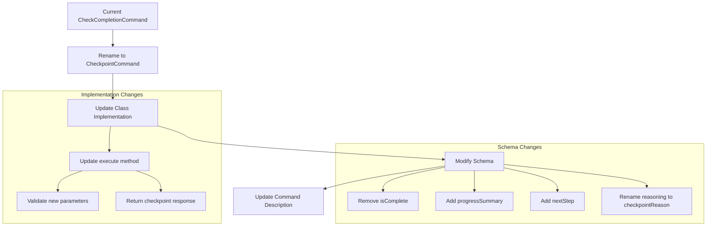

# Checkpoint Tool Implementation Plan

## Overview
Transform the current `CheckCompletionCommand` into a `CheckpointCommand` that pauses execution for user feedback at strategic points, summarizes progress, and suggests next steps.

## Component Changes



## Detailed Changes

### 1. Rename and Restructure Command
- Rename `CheckCompletionCommand` to `CheckpointCommand`
- Update class description to clearly explain checkpoint usage
- Update interface references if needed

### 2. Schema Updates
```typescript
properties: {
    description: {
        type: 'string',
        description: 'Description of the checkpoint - what has been completed and why feedback is needed'
    },
    progressSummary: {
        type: 'string',
        description: 'Summary of what has been accomplished up to this point'
    },
    checkpointReason: {
        type: 'string',
        description: 'Explanation of why this is a good point to pause and get feedback'
    },
    nextStep: {
        type: 'string',
        description: 'Suggested next step or action after this checkpoint'
    }
}
```

### 3. Implementation Updates
- Modify execute method to handle new parameters
- Update validation logic
- Implement new return structure
- Add proper error handling for missing required fields

### 4. Documentation
- Add clear JSDoc comments explaining when to use checkpoints
- Include examples of good checkpoint usage
- Document the feedback collection process