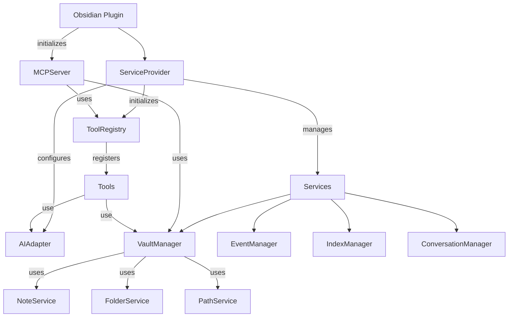
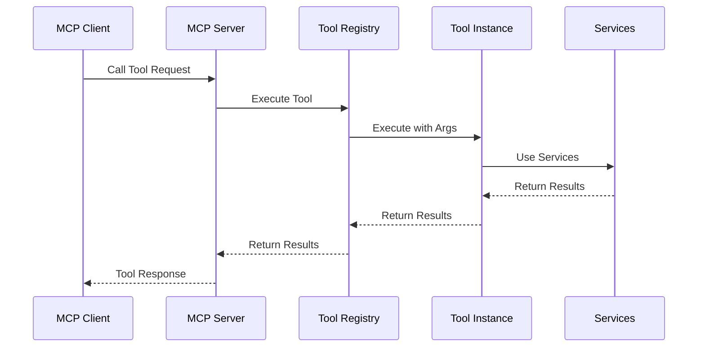
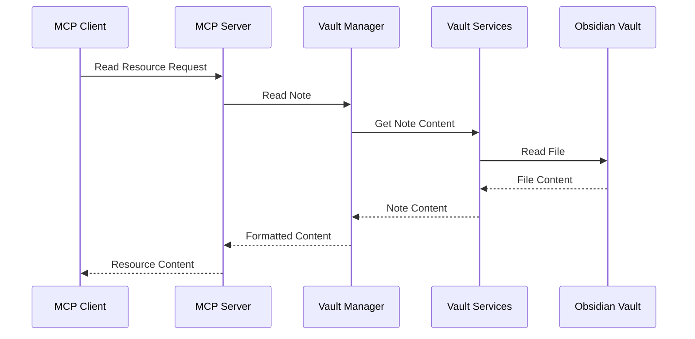

# System Patterns: Claudesidian MCP

## System Architecture

Claudesidian MCP follows a modular, service-oriented architecture with clear separation of concerns. The system is built around several key components that work together to provide MCP functionality within Obsidian.

### High-Level Architecture



### Component Layers

1. **Plugin Layer**: Main plugin class that initializes all components and manages the lifecycle.
2. **Service Layer**: Core services that provide functionality to the rest of the system.
3. **Tool Layer**: MCP tools that expose functionality to AI assistants.
4. **MCP Server Layer**: Implements the Model Context Protocol and handles client connections.
5. **Adapter Layer**: Interfaces with external systems like AI providers.

## Key Technical Decisions

### 1. Dependency Injection Pattern

The plugin uses a dependency injection pattern through the `ServiceProvider` class to manage service instances and their dependencies. This approach:

- Makes dependencies explicit through constructor injection
- Improves testability by allowing mock dependencies
- Reduces coupling between components
- Centralizes service management

Example:
```typescript
// Service provider creates and manages dependencies
const pathService = new PathService();
const noteService = new NoteService(vault, pathService);
const folderService = new FolderService(vault, pathService);

// Services are injected where needed
const vaultManager = new VaultManagerFacade(
    noteService,
    folderService,
    pathService,
    app
);
```

### 2. Interface-Based Design

All major components implement interfaces, which:

- Defines clear contracts between components
- Enables multiple implementations of the same interface
- Facilitates testing through mock implementations
- Reduces coupling between concrete implementations

Example interfaces:
- `INoteService`
- `IFolderService`
- `IPathService`
- `IVaultManager`
- `IAIAdapter`
- `IToolRegistry`

### 3. Facade Pattern

The `VaultManagerFacade` implements the facade pattern to:

- Provide a simplified interface to the vault operations
- Maintain backward compatibility with code expecting the original `VaultManager`
- Coordinate operations across multiple services
- Hide implementation details from clients

### 4. Tool Registry Pattern

The `ToolRegistry` implements a registry pattern to:

- Dynamically register and manage available tools
- Provide a central point for tool discovery
- Handle tool execution and lifecycle
- Manage tool context and dependencies

### 5. Phased Initialization

The plugin uses a phased initialization approach to:

- Handle dependencies correctly during startup
- Provide early feedback to users through the status bar
- Ensure critical components are initialized before dependent ones
- Gracefully handle initialization failures

## Design Patterns in Use

### 1. Factory Pattern

Used in the `ServiceProvider` to create service instances:

```typescript
initializeToolRegistry(
    eventManager: EventManager,
    indexManager: IndexManager
): ToolRegistry {
    // Create tool registry
    const toolRegistry = new ToolRegistry(
        this.app,
        this.plugin,
        this.get<IVaultManager>('vaultManager') as any,
        indexManager,
        eventManager
    );
    
    this.services.set('toolRegistry', toolRegistry);
    
    return toolRegistry;
}
```

### 2. Observer Pattern

Used in the `EventManager` to handle events and notifications:

```typescript
// Register event handlers
this.registerEvent(
    this.app.vault.on('create', () => {
        this.checkAndCreateFolders();
    })
);
```

### 3. Strategy Pattern

Used in the AI adapters to support different AI providers:

```typescript
// Different strategies for different AI providers
const aiAdapter = new OpenRouterAdapter(httpClient);
```

### 4. Command Pattern

Used in the tools to encapsulate operations:

```typescript
// Each tool encapsulates a specific operation
async execute(args: any): Promise<any> {
    const { action } = args;
    switch (action) {
        case 'create':
            return await this.createNote(args);
        case 'read':
            return await this.readNote(args);
        // ...
    }
}
```

### 5. Singleton Pattern

Used for managers that should have only one instance:

```typescript
// ServiceProvider ensures only one instance of each service
get<T>(serviceName: string): T {
    const service = this.services.get(serviceName);
    if (!service) {
        throw new Error(`Service ${serviceName} not found`);
    }
    return service as T;
}
```

## Component Relationships

### Service Provider and Services

The `ServiceProvider` is the central hub that:
- Creates and initializes all services
- Manages dependencies between services
- Provides access to services through a registry
- Configures services based on plugin settings

### MCP Server and Tools

The `MCPServer`:
- Exposes tools registered in the `ToolRegistry` to MCP clients
- Handles MCP protocol communication
- Manages client connections and requests
- Delegates tool execution to the `ToolRegistry`

### Vault Manager and Services

The `VaultManagerFacade`:
- Coordinates between `NoteService`, `FolderService`, and `PathService`
- Provides a unified interface for vault operations
- Handles path normalization and validation
- Manages folder structure and creation

### Tools and Services

Each tool:
- Receives a `ToolContext` with access to services
- Uses services to implement its functionality
- Defines its own schema for arguments
- Handles validation and execution of operations

## Data Flow

### Tool Execution Flow



### Resource Access Flow



## Technical Constraints

1. **Obsidian API Limitations**
   - Must work within Obsidian's plugin API constraints
   - Limited access to some internal Obsidian functionality
   - Must handle Obsidian's asynchronous file operations

2. **MCP Protocol Requirements**
   - Must implement the MCP protocol specification correctly
   - Must handle protocol versioning and capability negotiation
   - Must support required MCP features (tools, resources)

3. **Cross-Platform Compatibility**
   - Must work on Windows, macOS, and Linux
   - Must handle platform-specific file path differences
   - Must support different IPC mechanisms for different platforms

4. **Performance Considerations**
   - Must handle large vaults efficiently
   - Must minimize impact on Obsidian's performance
   - Must handle concurrent operations gracefully
