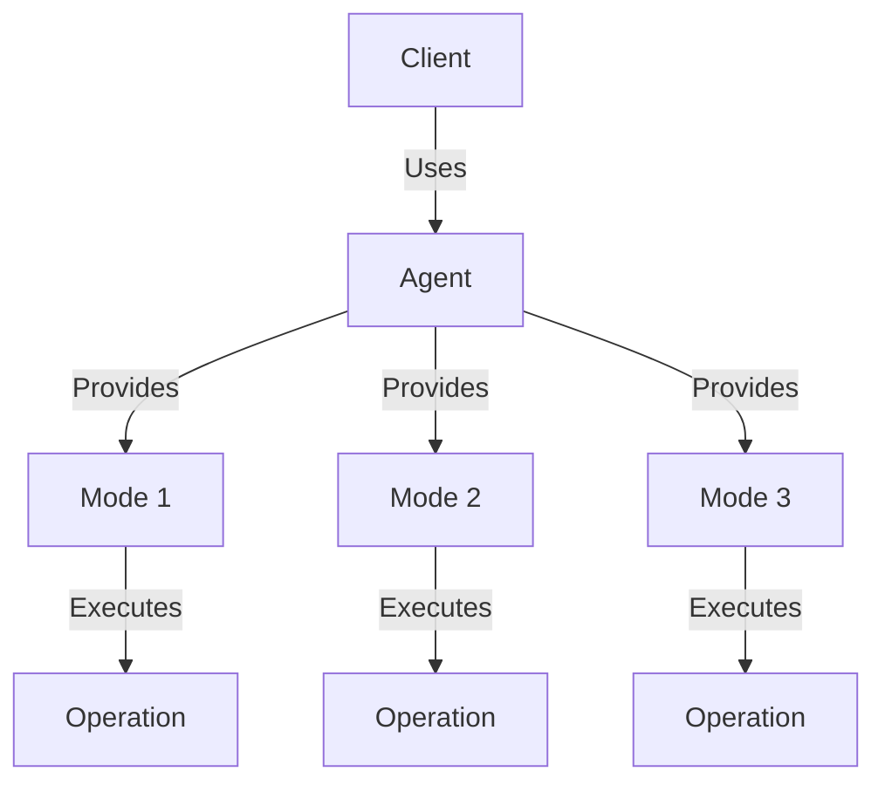
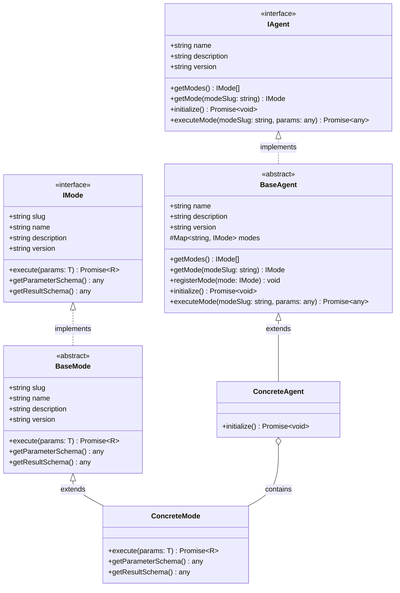
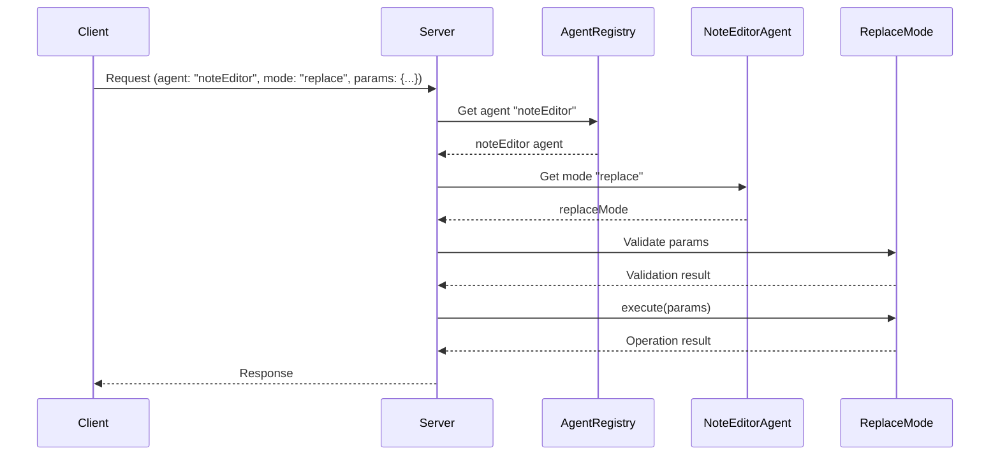
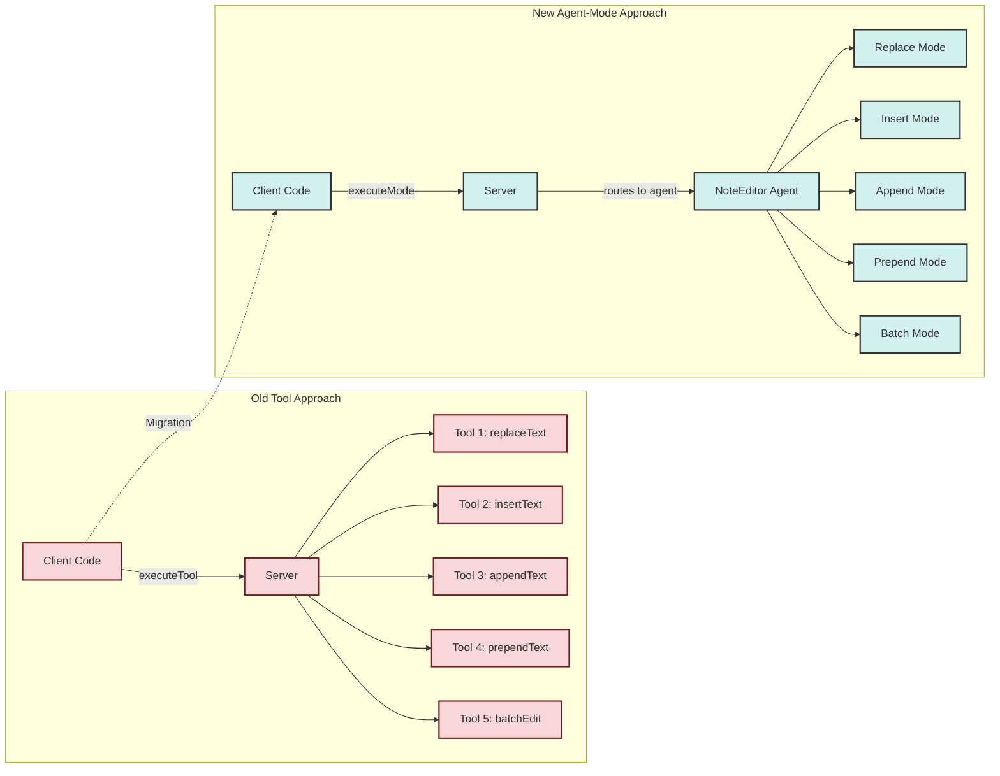
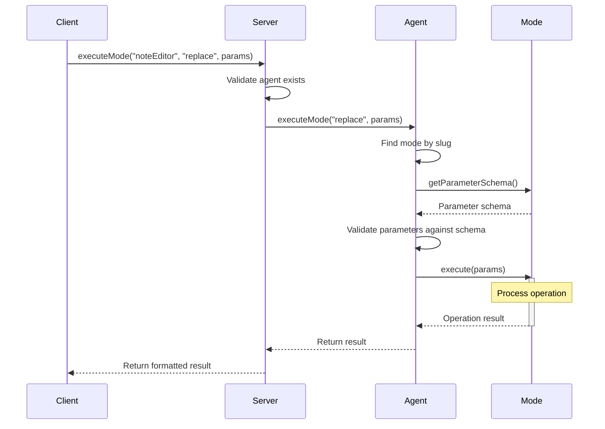
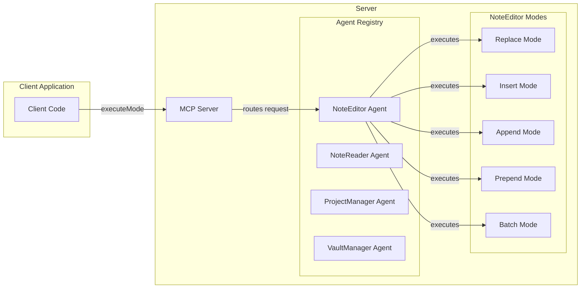

Agent-Mode Architecture Documentation
1. Overview of the Agent-Mode Architecture
Introduction
The Agent-Mode architecture represents a significant evolution in our plugin's design, moving from individual tools to a more structured approach where agents provide multiple modes of operation. This architecture organizes functionality into logical domains (agents) with specific operations (modes) within each domain.

Why We Moved from Tools to Agents with Modes
The previous tool-based approach had several limitations:

Lack of Organization: Tools were loosely organized, making it difficult to understand relationships between related functionalities
Inconsistent Interfaces: Each tool had its own interface, leading to inconsistent implementations
Limited Reusability: Code sharing between tools was challenging
Poor Discoverability: Finding the right tool for a specific task was difficult
Benefits of the New Approach
The agent-mode architecture provides several key advantages:

Domain-Driven Design: Functionality is organized by domain (agents), making the codebase more intuitive
Consistent Interfaces: All agents and modes follow the same interface patterns
Improved Maintainability: Common functionality is shared through base classes
Better Discoverability: Modes are grouped by agent, making it easier to find related functionality
Type Safety: Generic types for parameters and results provide better type checking
Schema Validation: Built-in schema definitions for parameters and results
Schema Validation: Built-in schema definitions for parameters and results


2. Architecture Details
IAgent Interface
The IAgent interface defines the contract for all agents in the system:

export interface IAgent {
  name: string;
  description: string;
  version: string;
  
  getModes(): IMode[];
  getMode(modeSlug: string): IMode | undefined;
  initialize(): Promise<void>;
  executeMode(modeSlug: string, params: any): Promise<any>;
}



Key responsibilities of an agent:

Providing metadata (name, description, version)
Managing a collection of modes
Initializing resources needed by its modes
Executing modes with appropriate parameters
IMode Interface
The IMode interface defines the contract for all modes:

export interface IMode<T = any, R = any> {
  slug: string;
  name: string;
  description: string;
  version: string;
  
  execute(params: T): Promise<R>;
  getParameterSchema(): any;
  getResultSchema(): any;
}
Key responsibilities of a mode:

Providing metadata (slug, name, description, version)
Executing operations with typed parameters
Defining parameter and result schemas for validation
How the Server Handles Agent-Mode Operations
The server manages agents and routes requests to the appropriate mode:

Registration: Agents register themselves with the server during initialization
Discovery: The server provides endpoints to discover available agents and their modes
Execution: Client requests specify an agent and mode to execute
Routing: The server routes the request to the appropriate agent and mode
Validation: Parameters are validated against the mode's schema
Execution: The mode executes the operation
Response: Results are returned to the client


3. Developer Guide
Creating a New Agent with Modes
Step 1: Define Types
First, define the types for your agent's operations:

// src/agents/myAgent/types.ts
export enum MyOperationType {
  OPERATION_ONE = 'operationOne',
  OPERATION_TWO = 'operationTwo'
}

export interface OperationOneParams {
  param1: string;
  param2: number;
}

export interface OperationOneResult {
  success: boolean;
  data?: any;
  error?: string;
}

// Define other operation types, params, and results...
Step 2: Create Modes
Create a mode for each operation:

// src/agents/myAgent/modes/operationOneMode.ts
import { BaseMode } from '../../baseMode';
import { OperationOneParams, OperationOneResult } from '../types';

export class OperationOneMode extends BaseMode<OperationOneParams, OperationOneResult> {
  constructor() {
    super(
      'operationOne',
      'Operation One',
      'Performs operation one',
      '1.0.0'
    );
  }
  
  async execute(params: OperationOneParams): Promise<OperationOneResult> {
    try {
      // Implement operation logic
      return {
        success: true,
        data: { /* result data */ }
      };
    } catch (error) {
      return {
        success: false,
        error: error.message
      };
    }
  }
  
  getParameterSchema(): any {
    return {
      type: 'object',
      properties: {
        param1: {
          type: 'string',
          description: 'First parameter'
        },
        param2: {
          type: 'number',
          description: 'Second parameter'
        }
      },
      required: ['param1', 'param2']
    };
  }
}
Step 3: Create the Agent
Create the agent to manage all modes:

// src/agents/myAgent/myAgent.ts
import { BaseAgent } from '../baseAgent';
import { OperationOneMode } from './modes/operationOneMode';
import { OperationTwoMode } from './modes/operationTwoMode';

export class MyAgent extends BaseAgent {
  constructor() {
    super(
      'myAgent',
      'My Agent',
      'Provides operations for my domain',
      '1.0.0'
    );
    
    // Register modes
    this.registerMode(new OperationOneMode());
    this.registerMode(new OperationTwoMode());
  }
  
  async initialize(): Promise<void> {
    // Initialize resources needed by modes
    // For example, connect to databases, load configuration, etc.
  }
}
Step 4: Export Modes and Agent
Create index files to export your modes and agent:

// src/agents/myAgent/modes/index.ts
export * from './operationOneMode';
export * from './operationTwoMode';

// src/agents/myAgent/index.ts
export * from './myAgent';
export * from './modes';
export * from './types';
Step 5: Register the Agent with the Server
Register your agent with the server during plugin initialization:

// src/main.ts
import { MyAgent } from './agents/myAgent';

// In your plugin's onload method:
const myAgent = new MyAgent();
await myAgent.initialize();
this.server.registerAgent(myAgent);
Adding a New Mode to an Existing Agent
To add a new mode to an existing agent:

Define the operation type, parameters, and result types
Create a new mode class extending BaseMode
Register the mode with the agent
// 1. Add to types.ts
export interface NewOperationParams {
  // Define parameters
}

export interface NewOperationResult {
  // Define result
}

// 2. Create new mode
export class NewOperationMode extends BaseMode<NewOperationParams, NewOperationResult> {
  constructor() {
    super('newOperation', 'New Operation', 'Description', '1.0.0');
  }
  
  async execute(params: NewOperationParams): Promise<NewOperationResult> {
    // Implement operation
  }
  
  getParameterSchema(): any {
    // Define schema
  }
}

// 3. Register with agent (in agent constructor)
this.registerMode(new NewOperationMode());
Best Practices for Mode Implementation
Single Responsibility: Each mode should perform a single, well-defined operation
Proper Error Handling: Always catch exceptions and return structured error responses
Complete Parameter Validation: Define comprehensive schemas for parameters
Clear Documentation: Document parameters, results, and behavior
Consistent Naming: Use consistent naming conventions for modes and parameters
Typed Parameters and Results: Use TypeScript generics for type safety
Reuse Common Logic: Extract shared logic into utility classes
Testability: Design modes to be easily testable
4. Client Usage Examples
Calling Agents with Different Modes
Basic Usage
// Execute a mode
const result = await server.executeMode('noteEditor', 'replace', {
  path: 'path/to/note.md',
  search: 'old text',
  replace: 'new text',
  replaceAll: true
});

// Check result
if (result.success) {
  console.log('Text replaced successfully');
} else {
  console.error('Error:', result.error);
}
Using Type Safety
import { ReplaceModeParams, EditResult } from './agents/noteEditor/types';

// With type safety
const params: ReplaceModeParams = {
  path: 'path/to/note.md',
  search: 'old text',
  replace: 'new text',
  replaceAll: true
};

const result: EditResult = await server.executeMode('noteEditor', 'replace', params);
Common Operations Examples
Example 1: Editing a Note
// Replace text
await server.executeMode('noteEditor', 'replace', {
  path: 'note.md',
  search: 'old text',
  replace: 'new text'
});

// Insert text at line 10
await server.executeMode('noteEditor', 'insert', {
  path: 'note.md',
  content: 'New content',
  position: 10
});

// Append text to the end
await server.executeMode('noteEditor', 'append', {
  path: 'note.md',
  content: 'Content to append'
});
Example 2: Batch Operations
// Perform multiple edits in one operation
await server.executeMode('noteEditor', 'batch', {
  operations: [
    {
      type: 'replace',
      path: 'note.md',
      search: 'old text',
      replace: 'new text'
    },
    {
      type: 'append',
      path: 'note.md',
      content: 'Appended content'
    }
  ]
});
Migration Guide from Old Tool Approach to Agent-Mode Architecture
The plugin has fully migrated to the agent-mode architecture, and all backward compatibility with the old tool approach has been removed.



Before (Old Tool Approach - No Longer Supported)
```javascript
// Old approach - NO LONGER SUPPORTED
const result = await server.executeTool('noteEditor', 'replaceText', {
  path: 'note.md',
  search: 'old text',
  replace: 'new text'
});
```

After (Agent-Mode Approach)
```javascript
// Current approach
const result = await server.executeMode('noteEditor', 'replace', {
  path: 'note.md',
  search: 'old text',
  replace: 'new text'
});
```

Migration Steps
1. Identify the Tool: Determine which tool you were using
2. Find the Corresponding Agent: Locate the agent that provides similar functionality
3. Select the Appropriate Mode: Choose the mode that matches your operation
4. Update Parameters: Adjust parameters to match the mode's schema
5. Update Result Handling: Modify code to handle the new result format

> **Important Note**: The server method `executeAgentTool` has been renamed to `executeAgentMode` to better reflect the agent-mode architecture. If you were using this method directly, you'll need to update your code.



5. API Reference
Available Agents and Their Modes

## NoteEditor Agent
The NoteEditor agent provides operations for editing notes in the vault.

| Mode     | Description                    | Parameters                                      | Result                    |
|----------|--------------------------------|-------------------------------------------------|---------------------------|
| replace  | Replace text in a note         | path, search, replace, replaceAll               | success, error            |
| insert   | Insert text at a position      | path, content, position                         | success, error            |
| delete   | Delete lines from a note       | path, startPosition, endPosition                | success, error            |
| append   | Append text to a note          | path, content                                   | success, error            |
| prepend  | Prepend text to a note         | path, content                                   | success, error            |
| batch    | Perform multiple operations    | operations[]                                    | results[], success        |

**Example Usage:**
```javascript
// Replace text in a note
await server.executeMode('noteEditor', 'replace', {
  path: 'notes/example.md',
  search: 'old text',
  replace: 'new text',
  replaceAll: true
});

// Batch edit operations
await server.executeMode('noteEditor', 'batch', {
  operations: [
    {
      type: 'replace',
      path: 'notes/example.md',
      search: 'old text',
      replace: 'new text'
    },
    {
      type: 'append',
      path: 'notes/example.md',
      content: 'Appended content'
    }
  ]
});
```

## NoteReader Agent
The NoteReader agent provides operations for reading notes from the vault.

| Mode      | Description                     | Parameters                                      | Result                    |
|-----------|---------------------------------|-------------------------------------------------|---------------------------|
| readNote  | Read the content of a note      | path                                            | content, path             |
| batchRead | Read multiple notes at once     | paths[]                                         | notes{}, errors{}         |
| readLine  | Read specific lines from a note | path, startLine, endLine                        | lines[], path, startLine, endLine |

**Example Usage:**
```javascript
// Read a note's content
const result = await server.executeMode('noteReader', 'readNote', {
  path: 'notes/example.md'
});
console.log(result.content);

// Read specific lines from a note
const lineResult = await server.executeMode('noteReader', 'readLine', {
  path: 'notes/example.md',
  startLine: 10,
  endLine: 20
});
console.log(lineResult.lines);
```

## ProjectManager Agent
The ProjectManager agent provides operations for managing projects.

| Mode         | Description                    | Parameters                                      | Result                    |
|--------------|--------------------------------|-------------------------------------------------|---------------------------|
| projectPlan  | Generate a project plan        | primaryGoal, subgoals, path                     | plan, path, success       |
| askQuestion  | Ask a question about a project | context, questions                              | questions, context, requiresUserInput |
| checkpoint   | Create a project checkpoint    | description, progressSummary, checkpointReason, nextStep, projectPath | success, requiresUserInput |

**Example Usage:**
```javascript
// Generate a project plan
const planResult = await server.executeMode('projectManager', 'projectPlan', {
  primaryGoal: 'Create a knowledge management system',
  subgoals: [
    {
      description: 'Design database schema',
      steps: [
        { stepDescription: 'Define entities', needsTool: false },
        { stepDescription: 'Define relationships', needsTool: false }
      ]
    }
  ],
  path: 'projects/knowledge-system.md'
});

// Create a checkpoint
await server.executeMode('projectManager', 'checkpoint', {
  description: 'Completed database schema design',
  progressSummary: 'Defined all entities and relationships',
  nextStep: 'Begin implementation of data access layer',
  projectPath: 'projects/knowledge-system.md'
});
```

## PaletteCommander Agent
The PaletteCommander agent provides operations for executing commands from the command palette.

| Mode           | Description                       | Parameters                                      | Result                    |
|----------------|-----------------------------------|-------------------------------------------------|---------------------------|
| listCommands   | List available commands           | filter (optional)                               | commands[], total         |
| executeCommand | Execute a command by ID           | id                                              | id, success, error        |

**Example Usage:**
```javascript
// List available commands
const commands = await server.executeMode('paletteCommander', 'listCommands', {
  filter: 'note'
});
console.log(commands.commands);

// Execute a command
await server.executeMode('paletteCommander', 'executeCommand', {
  id: 'app:create-new-note'
});
```

## VaultLibrarian Agent
The VaultLibrarian agent provides operations for searching and navigating the vault.

| Mode             | Description                       | Parameters                                      | Result                    |
|------------------|-----------------------------------|-------------------------------------------------|---------------------------|
| searchContent    | Search note content               | query, paths, limit, includeMetadata            | results[], total          |
| searchTag        | Find notes with specific tag      | tag, paths, limit                               | files[], total            |
| searchProperty   | Find notes with specific property | key, value, paths, limit                        | files[], total            |
| listFolder       | List contents of a folder         | path, includeFiles, includeFolders              | path, files[], folders[]  |
| listNote         | List notes in the vault           | path, extension, limit                          | notes[], total            |
| listTag          | List all tags in the vault        | prefix, limit                                   | tags[], total             |
| listProperties   | List all properties in the vault  | key, limit                                      | properties{}, total       |

**Example Usage:**
```javascript
// Search for content
const searchResults = await server.executeMode('vaultLibrarian', 'searchContent', {
  query: 'important concept',
  limit: 10,
  includeContent: true
});
console.log(searchResults.results);

// List all markdown files in a folder
const notes = await server.executeMode('vaultLibrarian', 'listNote', {
  path: 'projects',
  extension: 'md'
});
console.log(notes.notes);
```

## VaultManager Agent
The VaultManager agent provides operations for managing files and folders in the vault.

| Mode          | Description                       | Parameters                                      | Result                    |
|---------------|-----------------------------------|-------------------------------------------------|---------------------------|
| createNote    | Create a new note                 | path, content, overwrite                        | path, success, error      |
| createFolder  | Create a new folder               | path                                            | path, success, error      |
| deleteNote    | Delete a note                     | path                                            | path, success, error      |
| deleteFolder  | Delete a folder                   | path, recursive                                 | path, success, error      |
| moveNote      | Move a note to a new location     | path, newPath, overwrite                        | path, newPath, success    |
| moveFolder    | Move a folder to a new location   | path, newPath, overwrite                        | path, newPath, success    |

**Example Usage:**
```javascript
// Create a new note
await server.executeMode('vaultManager', 'createNote', {
  path: 'notes/new-note.md',
  content: '# New Note\n\nThis is a new note created by the VaultManager agent.',
  overwrite: false
});

// Move a note to a new location
await server.executeMode('vaultManager', 'moveNote', {
  path: 'notes/old-location.md',
  newPath: 'archive/new-location.md',
  overwrite: false
});
```

### Parameter Schemas

#### NoteEditor - Replace Mode
```json
{
  "type": "object",
  "properties": {
    "path": {
      "type": "string",
      "description": "Path to the note"
    },
    "search": {
      "type": "string",
      "description": "Text to search for in the note"
    },
    "replace": {
      "type": "string",
      "description": "Text to replace the search text with"
    },
    "replaceAll": {
      "type": "boolean",
      "description": "Whether to replace all occurrences of the search text"
    }
  },
  "required": ["path", "search", "replace"]
}
```

#### NoteEditor - Batch Mode
```json
{
  "type": "object",
  "properties": {
    "operations": {
      "type": "array",
      "items": {
        "type": "object",
        "oneOf": [
          {
            "type": "object",
            "properties": {
              "type": { "enum": ["replace"] },
              "path": { "type": "string" },
              "search": { "type": "string" },
              "replace": { "type": "string" },
              "replaceAll": { "type": "boolean" }
            },
            "required": ["type", "path", "search", "replace"]
          },
          {
            "type": "object",
            "properties": {
              "type": { "enum": ["insert"] },
              "path": { "type": "string" },
              "content": { "type": "string" },
              "position": { "type": "number" }
            },
            "required": ["type", "path", "content", "position"]
          }
        ]
      }
    }
  },
  "required": ["operations"]
}
```

#### NoteReader - ReadLine Mode
```json
{
  "type": "object",
  "properties": {
    "path": {
      "type": "string",
      "description": "Path to the note"
    },
    "startLine": {
      "type": "number",
      "description": "Start line (1-based)"
    },
    "endLine": {
      "type": "number",
      "description": "End line (1-based, inclusive)"
    }
  },
  "required": ["path", "startLine", "endLine"]
}
```

#### ProjectManager - ProjectPlan Mode
```json
{
  "type": "object",
  "properties": {
    "primaryGoal": {
      "type": "string",
      "description": "Primary goal of the project"
    },
    "subgoals": {
      "type": "array",
      "items": {
        "type": "object",
        "properties": {
          "description": {
            "type": "string",
            "description": "Description of the subgoal"
          },
          "steps": {
            "type": "array",
            "items": {
              "type": "object",
              "properties": {
                "stepDescription": {
                  "type": "string",
                  "description": "Description of the step"
                },
                "needsTool": {
                  "type": "boolean",
                  "description": "Whether this step requires specific tools"
                }
              },
              "required": ["stepDescription", "needsTool"]
            }
          }
        },
        "required": ["description", "steps"]
      }
    },
    "path": {
      "type": "string",
      "description": "Path to save the project plan"
    }
  },
  "required": ["primaryGoal", "path"]
}
```

#### PaletteCommander - ExecuteCommand Mode
```json
{
  "type": "object",
  "properties": {
    "id": {
      "type": "string",
      "description": "Command ID"
    }
  },
  "required": ["id"]
}
```

#### VaultLibrarian - SearchContent Mode
```json
{
  "type": "object",
  "properties": {
    "query": {
      "type": "string",
      "description": "Query to search for"
    },
    "paths": {
      "type": "array",
      "items": {
        "type": "string"
      },
      "description": "Paths to search in (optional)"
    },
    "limit": {
      "type": "number",
      "description": "Maximum number of results to return (optional)"
    },
    "includeMetadata": {
      "type": "boolean",
      "description": "Whether to include metadata in the search (optional, default: true)"
    },
    "searchFields": {
      "type": "array",
      "items": {
        "type": "string"
      },
      "description": "Fields to search in (optional, default: [\"title\", \"content\", \"tags\"])"
    },
    "includeContent": {
      "type": "boolean",
      "description": "Whether to include content in the results (optional, default: false)"
    }
  },
  "required": ["query"]
}
```

#### VaultManager - CreateNote Mode
```json
{
  "type": "object",
  "properties": {
    "path": {
      "type": "string",
      "description": "Path to the note"
    },
    "content": {
      "type": "string",
      "description": "Content of the note"
    },
    "overwrite": {
      "type": "boolean",
      "description": "Whether to overwrite if the note already exists"
    }
  },
  "required": ["path", "content"]
}
```
### Conclusion
The agent-mode architecture provides a robust, maintainable, and extensible framework for organizing functionality in our plugin. By grouping related operations into domain-specific agents and implementing consistent interfaces, we've created a system that is easier to understand, maintain, and extend.

Our plugin now features six specialized agents, each handling a specific domain of functionality:

1. **NoteEditor** - For editing and modifying note content
2. **NoteReader** - For reading and retrieving note content
3. **ProjectManager** - For managing and organizing projects
4. **PaletteCommander** - For executing Obsidian commands programmatically
5. **VaultLibrarian** - For searching and navigating the vault
6. **VaultManager** - For managing files and folders in the vault

Each agent provides multiple modes of operation, giving developers a comprehensive toolkit for building powerful features while maintaining a clean, organized codebase. The consistent interface across all agents makes it easy to learn and use the entire system.

> **Note**: The plugin has fully migrated to the agent-mode architecture, and all backward compatibility with the old tool approach has been removed. All code should now use the agent-mode pattern exclusively.

Developers can easily add new agents and modes following the patterns established in this documentation, while clients can interact with the system through a simple, consistent API.



