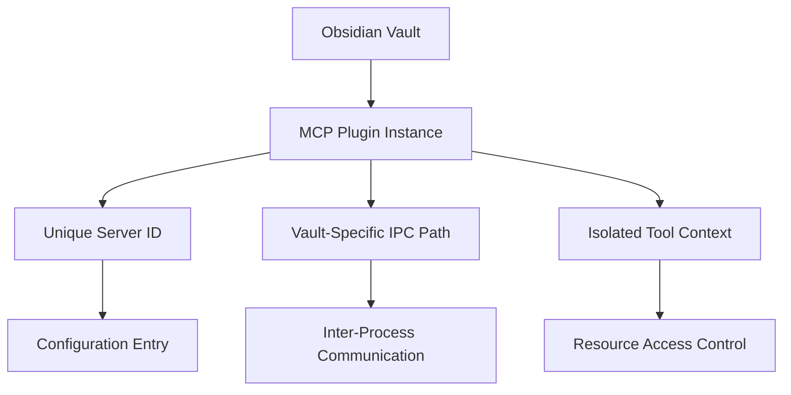

# Multi-Vault Support

This document explains how the Claudesidian MCP plugin supports multiple Obsidian vaults, allowing each vault to have its own isolated MCP server instance.

## Table of Contents
- [Overview](#overview)
- [Configuration Structure](#configuration-structure)
- [Server Identification](#server-identification)
- [Technical Implementation](#technical-implementation)
- [Considerations and Limitations](#considerations-and-limitations)

## Overview

The multi-vault feature allows you to use the Claudesidian MCP plugin across multiple Obsidian vaults simultaneously. Each vault runs its own isolated MCP server instance, ensuring that:
- Each vault has its own unique server identity
- Tools and resources are properly scoped to individual vaults
- Inter-process communication (IPC) paths are unique per vault
- Configuration settings are maintained separately for each vault

## Configuration Structure

The Claude Desktop configuration file (`claude_desktop_config.json`) organizes MCP servers by vault-specific identifiers. Here's an example structure:

```json
{
  "mcpServers": {
    "claudesidian-mcp-my-vault": {
      "command": "node",
      "args": [
        "C:\\Users\\username\\Documents\\My Vault\\.obsidian\\plugins\\claudesidian-mcp\\connector.js"
      ]
    },
    "claudesidian-mcp-work-vault": {
      "command": "node",
      "args": [
        "C:\\Users\\username\\Documents\\Work Vault\\.obsidian\\plugins\\claudesidian-mcp\\connector.js"
      ]
    }
  }
}
```

Each vault entry in the configuration:
- Uses a sanitized vault name as part of its identifier
- Has its own command and arguments for launching the server
- Points to the connector.js file in that vault's plugin directory

## Server Identification

Each vault's MCP server instance is uniquely identified through several mechanisms:

1. **Server Identifier**: Generated using the pattern `claudesidian-mcp-[sanitized-vault-name]`
2. **IPC Path**: Created uniquely per vault:
   - Windows: `\\.\pipe\claudesidian_mcp_[sanitized-vault-name]`
   - Unix-like: `/tmp/claudesidian_mcp_[sanitized-vault-name].sock`

The vault name is sanitized by:
- Converting to lowercase
- Replacing spaces and special characters with hyphens
- Removing invalid characters

## Technical Implementation

The multi-vault support is implemented through several key components:



Key implementation details:
1. **Server Initialization**:
   - Each plugin instance checks its vault name
   - Creates a unique server identifier
   - Establishes vault-specific IPC paths
   
2. **Resource Isolation**:
   - Tools operate within their vault's context
   - File operations are scoped to the vault directory
   - Settings and configurations are vault-specific

3. **Communication Channels**:
   - Each vault uses dedicated IPC channels
   - Socket files/pipes are uniquely named
   - Prevents cross-talk between vault instances

## Considerations and Limitations

When using multiple vaults with the MCP plugin, keep in mind:

1. **Resource Usage**:
   - Each vault runs its own server process
   - Memory and CPU usage scales with the number of active vaults
   - Consider system resources when running multiple instances

2. **Configuration Management**:
   - Each vault requires its own configuration entry
   - Changes to one vault's settings don't affect others
   - Manual configuration updates may be needed per vault

3. **File Access**:
   - Tools can only access files within their vault
   - Cross-vault operations are not supported
   - Each vault maintains its own file context

4. **Troubleshooting**:
   - Check server identifiers in configuration for correct vault names
   - Verify IPC paths don't conflict
   - Monitor resource usage when running multiple vaults
   - Review logs for vault-specific server instances