# Emoji Tool Integration Plan

## Overview
This plan outlines the process for adding emojis to tool names to provide visual associations in the Claude interface.

## Emoji Associations

```mermaid
graph TD
    A[Identify Tool Files] --> B[Modify Each Tool Constructor]
    B --> C[Test in Claude]
    
    subgraph "Tool Modifications"
        D1[NoteEditorTool: ✏️ noteEditor]
        D2[NoteReaderTool: 📖 noteReader]
        D3[VaultLibrarianTool: 📚 vaultLibrarian]
        D4[VaultManagerTool: 📁 vaultManager]
        D5[TextGeneratorTool: ✨ textGenerator]
        D6[PaletteCommanderTool: 🎮 paletteCommander]
        D7[ProjectTool: 📋 projectManager]
    end
    
    B --> D1
    B --> D2
    B --> D3
    B --> D4
    B --> D5
    B --> D6
    B --> D7
```



## Implementation Details

1. For each tool, we'll modify the constructor to add the emoji at the beginning of the name property:

   ```typescript
   // Example for NoteEditorTool
   constructor(context: IToolContext) {
       super(context, {
           name: '✏️ noteEditor',
           description: 'Edit notes with precise operations...',
           // other properties
       });
   }
   ```

2. We'll apply the following emoji associations:
   - ✏️ NoteEditorTool
   - 📖 NoteReaderTool
   - 📚 VaultLibrarianTool
   - 📁 VaultManagerTool
   - ✨ TextGeneratorTool
   - 🎮 PaletteCommanderTool
   - 📋 ProjectTool

3. We'll need to modify these files:
   - src/tools/core/NoteEditorTool.ts
   - src/tools/core/NoteReaderTool.ts
   - src/tools/core/VaultLibrarianTool.ts
   - src/tools/core/VaultManagerTool.ts
   - src/tools/core/TextGeneratorTool.ts
   - src/tools/core/PaletteCommanderTool.ts
   - src/tools/core/ProjectTool.ts

## Implementation Steps

1. For each tool file:
   - Open the file
   - Locate the constructor
   - Add the appropriate emoji to the beginning of the name property
   - Save the file

2. Test the changes by:
   - Restarting the plugin
   - Verifying that the emojis appear correctly in the Claude interface