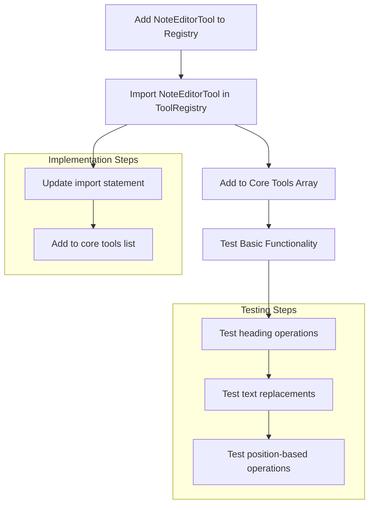

# Note Editor Integration Plan

## Overview
The plan outlines the steps to re-integrate the NoteEditorTool, which provides precise text operations on notes using Obsidian's APIs.

## Current State Analysis
- NoteEditorTool is fully implemented with complete functionality
- Supports comprehensive operations:
  - Inserting at headings (with wiki-links support)
  - Inserting at specific positions
  - Replacing text (single or all occurrences)
  - Appending/prepending to files
- Includes error handling and undo support
- Missing from ToolRegistry registration

## Implementation Plan

### Step 1: Add NoteEditorTool to Registry
- Import NoteEditorTool class in ToolRegistry.ts
- Add NoteEditorTool to core tools array in constructor

### Implementation Details
- The implementation is straightforward since:
  - NoteEditorTool class is already fully implemented
  - Proper integration with Obsidian's APIs exists
  - Comprehensive error handling is in place
  - Undo operations are supported

### Testing Plan
1. Basic Functionality Testing
   - Test each operation type:
     - Heading operations
     - Text replacements
     - Position-based operations
2. Error Handling Verification
3. Undo Functionality Testing