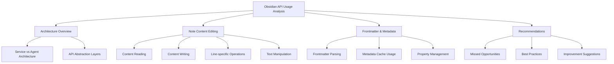

# Obsidian API Usage Analysis Plan

## Overview

This document outlines a plan for analyzing how the Obsidian API is being leveraged for note editing functionality in both the old implementation (`src_old`) and the current implementation (`src`). The analysis will focus primarily on note content editing functionality, with particular attention to how the API is used for reading, writing, and manipulating note content.

## 1. Architecture Overview

### 1.1 Service vs Agent Architecture

- Compare the centralized `NoteService` approach with the distributed agent-based approach
- Analyze how each architecture impacts API usage patterns
- Evaluate separation of concerns in both implementations
- Identify strengths and weaknesses of each approach for note editing operations

### 1.2 API Abstraction Layers

- Compare abstraction levels in both implementations
- Analyze how direct vs. indirect API access affects maintainability
- Evaluate the consistency of API usage across components
- Identify potential issues with abstraction leakage

## 2. Note Content Editing

### 2.1 Content Reading

- Compare `NoteService.readNote()` vs `ReadOperations.readNote()`
- Analyze how each implementation handles non-existent files
- Evaluate caching strategies for content reading
- Compare error handling approaches
- Identify API methods used and potential alternatives
- Analyze performance implications of different reading strategies

### 2.2 Content Writing

- Compare `NoteService.updateNote()` vs `EditOperations` methods
- Analyze atomic vs. granular update approaches
- Evaluate content validation before writing
- Compare error handling during write operations
- Identify API methods used and potential alternatives
- Analyze transaction safety in write operations

### 2.3 Line-specific Operations

- Compare `NoteService.readNoteLines()` vs line-specific tools
- Analyze line indexing and boundary handling
- Evaluate performance for large files
- Compare approaches to line-based editing
- Identify API methods used and potential alternatives
- Analyze handling of special cases (empty files, line endings)

### 2.4 Text Manipulation

- Compare text insertion, deletion, and replacement implementations
- Analyze search and replace strategies
- Evaluate handling of special characters and formatting
- Compare approaches to complex text operations
- Identify API methods used and potential alternatives
- Analyze undo/redo support in text operations

## 3. Frontmatter & Metadata

### 3.1 Frontmatter Parsing

- Compare frontmatter handling in both implementations
- Analyze YAML parsing strategies
- Evaluate frontmatter validation
- Compare approaches to frontmatter extraction
- Identify API methods used and potential alternatives
- Analyze error handling for malformed frontmatter

### 3.2 Metadata Cache Usage

- Compare how each implementation leverages Obsidian's metadata cache
- Analyze cache synchronization strategies
- Evaluate cache miss handling
- Compare approaches to metadata retrieval
- Identify API methods used and potential alternatives
- Analyze performance implications of different caching strategies

### 3.3 Property Management

- Compare property CRUD operations in both implementations
- Analyze property type handling
- Evaluate property validation
- Compare approaches to property updates
- Identify API methods used and potential alternatives
- Analyze handling of special property types

## 4. Recommendations

### 4.1 Missed Opportunities

- Identify Obsidian API features not fully utilized
- Analyze potential for deeper API integration
- Evaluate third-party plugin compatibility
- Suggest unexplored API capabilities that could enhance note editing

### 4.2 Best Practices

- Identify best practices from both implementations
- Analyze patterns worth preserving or extending
- Evaluate consistency with Obsidian ecosystem
- Suggest standardized approaches to common operations

### 4.3 Improvement Suggestions

- Provide specific code examples for improvements
- Analyze impact of suggested changes
- Evaluate implementation difficulty vs. benefit
- Suggest concrete refactoring steps

## Analysis Methodology

The analysis will be conducted through:

1. **Code Review**: Detailed examination of both implementations
2. **API Usage Mapping**: Identifying all Obsidian API touchpoints
3. **Comparative Analysis**: Side-by-side comparison of similar functionality
4. **Pattern Identification**: Recognizing common patterns and anti-patterns

## Deliverables

1. **Comprehensive Analysis Document**
   - Detailed comparison of both implementations
   - Code examples highlighting key differences
   - Specific API usage patterns

2. **Recommendations Summary**
   - Prioritized list of improvement opportunities
   - Concrete code examples for implementation
   - Impact assessment for each recommendation

3. **API Usage Best Practices Guide**
   - Distilled lessons from both implementations
   - Guidelines for future development
   - Common pitfalls to avoid

## Implementation Plan

After completing the analysis, we will:

1. Prioritize improvements based on impact and effort
2. Create specific implementation tasks
3. Develop test cases to validate improvements
4. Implement changes incrementally
5. Validate against existing functionality
