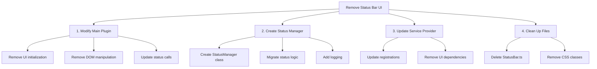

# Status Bar Removal Plan

## Overview
Remove the status bar UI components while preserving internal server status tracking functionality for debugging and logging purposes.



## Detailed Steps

1. Create New Status Manager
   - Create `StatusManager` class in `src/services/` to handle internal status tracking
   - Migrate status type definitions and state management
   - Add comprehensive logging for status changes

2. Modify Main Plugin (main.ts)
   - Remove StatusBar import
   - Replace statusBar property with statusManager
   - Remove initializeStatusBar method
   - Update all status-related calls to use statusManager
   - Remove addStatusBarItem and DOM manipulation

3. Update Service Provider
   - Remove StatusBar registration
   - Register new StatusManager service
   - Update any components using status bar service

4. Clean Up
   - Delete src/components/StatusBar.ts
   - Remove status bar related CSS classes
   - Update any remaining imports/references

## Code Changes Summary

### New Status Manager Implementation
```typescript
export class StatusManager {
    private currentStatus: ServerStatus = 'stopped';

    setStatus(status: ServerStatus) {
        this.currentStatus = status;
        console.log(`Server status changed to: ${status}`);
    }

    getStatus(): ServerStatus {
        return this.currentStatus;
    }
}
```

### Impact Assessment
- No functionality changes to server status tracking
- Maintains all debugging/logging capabilities
- Removes only UI-related code
- Simplified status management

Would you like to proceed with this plan?